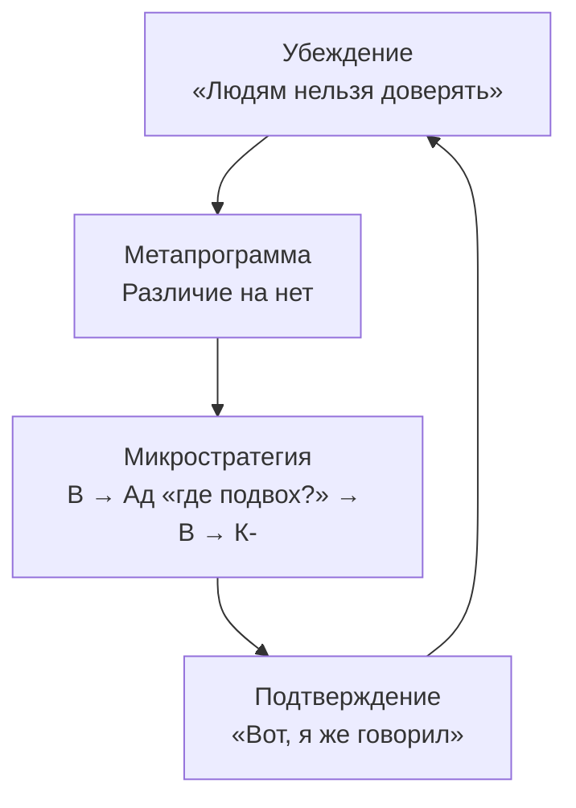
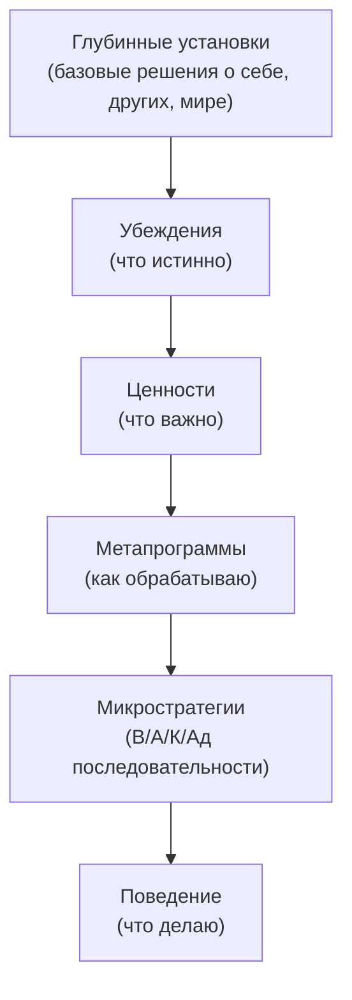

# Убеждения, ценности и метапрограммы
<small>← [Моделирование ценностей из текста](../values/values-modeling.md) · [Далее: Структура убеждений и ценностей →](18_beliefs-values-structure.md)</small>

🔴 Продвинутый · ⏱ 10 мин

*Вы пробуете «видеть сходство вместо различий» — получается день, два, а потом всё возвращается. Потому что за метапрограммой стоит убеждение, а за убеждением — глубинная установка.*

<b>Кратко</b>

- Убеждение → метапрограмма → подтверждающий опыт → убеждение (самоподдерживающийся цикл)
- Глубинные установки фиксируют целые кластеры метапрограмм
- Ценности управляют тем, какие метапрограммы активируются
- Для устойчивого изменения нужна работа на двух уровнях: микростратегии + убеждения
- 4 примера кластеров: «я недостаточно хорош», «мир опасен», «я особенный», «другие важнее»

> **📖 Теория:** О том, как устроены убеждения и ценности на уровне микростратегий (В/А/К/Ад), см. [Микростратегии убеждений и ценностей](18_beliefs-values-structure.md).

---

## Механизм фиксации

Убеждение задаёт фильтр (метапрограмму), фильтр отбирает подтверждающую информацию, информация укрепляет убеждение — **самоподдерживающийся цикл**:

> **Попробуйте:** Вспомните недавнюю ситуацию, когда вы были уверены, что «знали, как всё будет». Какая информация подтвердила вашу уверенность? А какую информацию вы могли пропустить?

---

## Примеры связки «убеждение → метапрограмма»

| Убеждение | Метапрограмма, которую фиксирует | Микростратегия |
|-----------|-----------------------------------|----------------|
| «Мир опасен» | Мотивация ОТ | В- (образ угрозы) → К- → Ад (как избежать?) |
| «Я сам разберусь» | Внутренняя референция | Ад (свой анализ) → К (проверка ощущением) |
| «Правильный ответ один» | Различие на нет | Ад (эталон) → В (сравнение) → К- (не совпадает) |
| «Важна общая картина» | Глобальный | В (панорама) → Ад (суть) |
| «Дьявол в деталях» | Детальный | В (фрагмент) → Ад (анализ) → В (следующий фрагмент) |
| «Сначала надо всё продумать» | Реактивный | Ад → К- (не уверен) — микростратегия повторяется циклически, пока К не станет положительным |
| «Кто не рискует — не пьёт шампанское» | Проактивный | К+ (импульс) → В (возможность) → действие |

> **Попробуйте:** Выберите одну свою привычную метапрограмму (например, «детальный» или «мотивация ОТ»). Сформулируйте убеждение, которое её поддерживает — начните со слов «Я считаю, что...» или «В моём мире...».

---

## Глубинные установки за метапрограммами

За таблицей «убеждение → метапрограмма» стоит более глубокий слой. Некоторые метапрограммы обусловлены не отдельными убеждениями, а **глубинными установками** — базовыми решениями о себе, других и мире, принятыми в раннем опыте и часто неосознаваемыми. Такие установки не формулируются словами — они переживаются как «просто так устроен мир».

Глубинная установка отличается от обычного убеждения:

| | Убеждение | Глубинная установка |
|---|-----------|---------------------|
| **Осознаётся?** | Обычно да, можно сформулировать | Часто нет — «рыба не замечает воду» |
| **Откуда?** | Из опыта, обучения, среды | Из раннего опыта, значимых событий, семейной системы |
| **Как переживается** | «Я так считаю» | «Так устроен мир» / «Я такой» |
| **Масштаб влияния** | На конкретную метапрограмму в конкретном контексте | На целый кластер метапрограмм во всех контекстах |

### Пример 1. «Я недостаточно хорош» → кластер метапрограмм

Человек с этой установкой может не формулировать её словами, но она проявляется как устойчивая конфигурация:

- **Внешняя референция (на других)** — «Другие знают лучше, мне нужно их одобрение». Микростратегия: А (что скажут?) → Ад (сравниваю с их ожиданиями) → К-/К+ (совпало или нет).
- **Мотивация ОТ** — «Главное — не облажаться». Вместо движения к цели — избегание ошибок.
- **Различие на нет** — направлено на себя: человек автоматически находит в своей работе то, что «не дотягивает».
- **Реактивный** — «Лучше подождать, пока станет ясно / пока кто-то попросит», потому что инициатива — это риск ошибки.

Всё это — не четыре отдельные проблемы, а одна установка, которая «разворачивается» в четыре метапрограммы. Работа с каждой метапрограммой по отдельности (через упражнения) даёт временный эффект. Работа с установкой меняет весь кластер.

**Как обнаружить:** Если человек «застрял» в нескольких метапрограммах одновременно, и все они тематически связаны — за ними, вероятно, стоит одна глубинная установка.

### Пример 2. «Мир непредсказуем и опасен» → кластер контроля

Установка формируется в среде, где ребёнок не мог предсказать реакции значимых взрослых: иногда за одно и то же хвалили, иногда наказывали.

Кластер:

- **Детальный** — нужно контролировать каждый элемент, потому что «дьявол в деталях» и любая упущенная мелочь может привести к катастрофе.
- **Процедуры** — строгий порядок действий, потому что отклонение от плана = потеря контроля = опасность.
- **Мотивация ОТ** — фокус на том, что может пойти не так.
- **Ориентация на прошлое** — «я знаю, что было, а будущее непредсказуемо», поэтому решения основаны на прецедентах.
- **Внутренняя референция** — «полагаться могу только на себя» (как защита от непредсказуемости других).

Характерная микростратегия кластера: В- (образ сбоя) → К- (тревога). Но эта микростратегия запускается *циклически*: тревога (К-) порождает новый анализ (Ад → В-), который порождает новую тревогу (К-), и так далее. Цикл сложно завершить, потому что каждый Ад-шаг генерирует новый В- → К-. Это не одна длинная цепочка, а многократный повтор одной короткой микростратегии.

### Пример 3. «Я особенный / мне всё легко даётся» → кластер лёгкости

Установка формируется, когда ребёнка хвалили за способности, а не за усилия (исследования Кэрол Дуэк о фиксированном мышлении).

Кластер:

- **Глобальный** — детали неинтересны, «я схватываю суть», погружение в подробности — для тех, кому «не дано».
- **Проактивный** — быстро берётся за новое, но быстро бросает, когда становится трудно.
- **Мотивация К** — но только к тому, что получается легко. Как только К+ исчезает — интерес теряется.
- **Опции** — множество начатых проектов, ни один не доведён до конца, потому что процедурное следование плану «скучно» и ассоциируется с «обычностью».
- **Ориентация на будущее** — «новое» привлекательнее «существующего», будущее — это пространство, где «я снова буду блистать».

Микростратегия «загорелся»: В+ (яркий образ нового) → К++ (восторг) → действие. Но при столкновении с рутиной срабатывает другая микростратегия: В (серая рутина) → К- (скука) → выход. Между ними может быть промежуточная: К- (скука) → Ад («это не моё»), которая оформляет ощущение в решение уйти.

Глубинная установка: «Если мне трудно — значит, это не моё». Она блокирует переход через [кризис компетентности](../learning-cycle/03_bandura.md), потому что усилие интерпретируется не как нормальная часть обучения, а как сигнал «не того» выбора.

### Пример 4. «Другие важнее меня» → кластер растворения

Установка из семей, где ребёнок рано стал «функцией» — заботиться о младших, поддерживать маму, не создавать проблем.

Кластер:

- **Внешняя референция (на других)** — не «что они думают?», а «что им нужно?». Свои потребности не осознаются.
- **Врата сортировки: Люди** — внимание всегда на других: кто что чувствует, кому чем помочь.
- **Сходство** — важно не выделяться, быть «удобным», не конфликтовать.
- **Реактивный** — инициатива направлена на других («чем помочь?»), но не на себя.

Микростратегия: А/В (воспринимаю состояние другого) → К (чувствую *его* ощущение как своё) → Ад (что ему нужно?) → действие для другого. Собственный К-отклик («а что я хочу?») отсутствует в цепочке — он просто не запускается.

### Что делать с глубинными установками

Глубинные установки не меняются одними упражнениями на метапрограммы. Но понимание их структуры позволяет:

1. **Перестать бороться с симптомами.** Если вы видите кластер связанных метапрограмм — ищите установку, а не пытайтесь менять каждую метапрограмму отдельно.

2. **Сформулировать установку.** Уже осознание «я живу так, будто мир опасен» — первый шаг. То, что осознано, перестаёт быть «просто так устроен мир» и становится «одним из возможных взглядов».

3. **Найти микростратегию установки.** Установка — это тоже репрезентация + субмодальности + К. Техники [субмодального переноса и «музея старых убеждений»](18_beliefs-values-structure.md#изменение-убеждений-через-микростратегии) работают и с установками, но требуют больше повторений.

4. **Создать новый опыт.** Самый мощный способ: целенаправленно действовать «вопреки» установке в безопасном контексте и обнаруживать, что катастрофа не наступает. Каждый такой эпизод ослабляет К-отклик установки.

5. **Обратиться за поддержкой.** Глубинные установки часто связаны с эмоционально значимым опытом. Работа с ними в сопровождении специалиста (терапевта, коуча) может быть значительно эффективнее самостоятельной.

> **Попробуйте:** Если вы замечаете у себя несколько «застрявших» метапрограмм (например, всегда реактивный + всегда внешняя референция + всегда мотивация ОТ), запишите их списком. Есть ли между ними общая тема? Какое базовое представление о себе или мире их объединяет?

---

## Как ценности управляют метапрограммами

Ценности — это **критерии** в T1-блоке [T.O.T.E.](../tote/04_tote-overview.md) Они определяют, что считается «хорошим результатом», а значит — какие метапрограммы будут активированы для его достижения.

| Ценность | Какие метапрограммы активирует | Почему |
|----------|-------------------------------|--------|
| Безопасность | ОТ, Различие, Детальный, Прошлое | Нужно видеть угрозы (различие), в деталях, на основе опыта (прошлое), и избегать их (ОТ) |
| Развитие | К, Сходство+Различие на новое, Будущее | Нужно видеть возможности (К), находить новое в знакомом (различие на новое), ориентируясь на будущее |
| Контроль | Внутренняя референция, Детальный, Процедуры | Нужно решать самому (внутренняя), видеть все части (детальный), по чёткому порядку (процедуры) |
| Свобода | Внутренняя референция, Глобальный, Опции | Нужно решать самому, видеть возможности (опции), не увязая в деталях (глобальный) |
| Принадлежность | Внешняя референция (другие), Сходство, Люди | Нужно соответствовать группе (внешняя), быть похожим (сходство), фокус на людях |

**Следствие:** Если вы хотите понять, почему человек «застрял» в определённых метапрограммах — ищите ценность, которая их активирует. И наоборот: если хотите, чтобы человек задействовал другие метапрограммы — покажите, как они служат его ценностям.

О том, как устроены ценности на уровне микростратегий (структура, иерархия, выявление), см. [Микростратегии убеждений и ценностей](18_beliefs-values-structure.md).

> **Попробуйте:** Назовите одну вашу важную ценность (например, «свобода» или «стабильность»). Какие три метапрограммы она активирует? Проверьте: действительно ли вы используете эти метапрограммы, когда дело касается этой ценности?

---

## Почему изменение метапрограммы «не держится»

Если метапрограмма закреплена убеждением, то поведенческие упражнения ([встраивание](../metaprograms/13a_installation-basics.md)) дадут временный эффект. Человек начнёт искать сходство, но внутренний голос будет говорить: «Зачем ты это делаешь? Различия важнее!» — и старая микростратегия вернётся.

**Для устойчивого изменения метапрограммы нужно работать на двух уровнях:**
1. **Микростратегический** — изменить последовательность В/А/К/Ад ([встраивание через микростратегии](../microstrategies/14a_what-is-microstrategy.md))
2. **Уровень убеждений** — изменить убеждение, которое фиксирует старую микростратегию

> **Попробуйте:** Вспомните случай, когда вы пробовали изменить своё поведение (например, начать делать зарядку или перестать откладывать дела), но изменение «не прижилось». Какое убеждение могло саботировать эту попытку?

---

## Связь уровней

**Уточнение о месте убеждений и ценностей.** В классической НЛП-модели (пирамида логических уровней Дилтса) убеждения и ценности стоят **на одном уровне** — они рассматриваются как единый блок, влияющий на способности и поведение. Однако в научной психологии (когнитивная терапия Бека, схема-терапия Янга, теория привязанности) эти уровни разведены, и направление влияния идёт снизу вверх: **глубинные установки и убеждения формируют ценности**. Эта иерархия отражена в пирамиде логических уровней Плигина, которая приводит НЛП-модель в соответствие с данными научной психологии.

Человек, который в раннем опыте усвоил установку «мир опасен», не выбирает ценность «безопасность» — она формируется *как следствие* установки. Ребёнок, выросший в непредсказуемой среде, не «решает», что контроль важен — ценность контроля вырастает из глубинной схемы уязвимости.

Практически это означает: если ценность кажется ригидной и человек не может «просто выбрать другое» — за ней, вероятно, стоит глубинная установка (примеры — в разделе выше). Работа с установкой может естественным образом перестроить иерархию ценностей.

Каждый уровень **реализуется** через нижестоящий и **управляется** вышестоящим (а формируется — часто снизу вверх, от раннего опыта к ценностям):

| Связь | Как работает | Пример |
|-------|-------------|--------|
| Убеждение → Ценность | Убеждения формируют то, что становится важным | Убеждение «мир опасен» → ценность «безопасность» |
| Убеждение → Метапрограмма | Убеждение активирует фильтр | «Людям нельзя доверять» → Различие на нет |
| Метапрограмма → Микростратегия | Метапрограмма реализуется через мгновенную цепочку | Различие на нет → В (два образа) → Ад(«не совпадает») → К- |

> **Примечание.** На диаграмме показаны микростратегии — внутренние В/А/К/Ад-цепочки, реализующие отдельный шаг обработки информации. На том же уровне существуют **макростратегии** — последовательности действий в деятельности (как человек подходит к проекту, принимает решения, организует работу). Макростратегия состоит из шагов, каждый из которых реализуется через микростратегию. Метапрограммы влияют на оба масштаба.
| Микростратегия → Поведение | Цепочка порождает действие | К- → избегание, закрытость |

### Работа снизу вверх и сверху вниз

**Работа снизу вверх** (от микростратегий к убеждениям):
- Изменение микростратегии создаёт новый опыт
- Новый опыт ставит под вопрос старое убеждение
- Убеждение ослабевает, открывая пространство для нового

**Работа сверху вниз** (от убеждений к микростратегиям):
- Изменение убеждения снимает «блокировку» со старой микростратегии
- Становится возможным встраивание новой цепочки
- Новая цепочка закрепляется, потому что убеждение её поддерживает

**Наиболее устойчивый результат** — одновременная работа на обоих уровнях.

> **Попробуйте:** Возьмите одно своё убеждение (например, «люди непредсказуемы» или «я справлюсь сам»). Проследите путь вниз: какую метапрограмму оно активирует → какую микростратегию → какое поведение. Запишите эту цепочку.

---

## Практические упражнения

Практические упражнения по работе с убеждениями и метапрограммами — в документе [Встраивание работы с убеждениями и ценностями](21a_beliefs-program.md).

Там вы найдёте:
- Программу тренировки (4 этапа)
- Упражнение «Карта убеждений метапрограммы»
- Упражнение «Разрыв цикла "убеждение → метапрограмма → подтверждение"»
- Упражнение «Ценность как ресурс для новой метапрограммы»
- Техники изменения убеждений (субмодальный перенос, музей старых убеждений)

---

## Связь с другими инструментами

| Инструмент | Как связан |
|------------|------------|
| **[Встраивание работы с убеждениями и ценностями](21a_beliefs-program.md)** | Практическая программа тренировки: упражнения, техники изменения убеждений, работа с глубинными установками |
| **[Микростратегии убеждений и ценностей](18_beliefs-values-structure.md)** | Как устроены убеждения и ценности на уровне В/А/К/Ад, техники изменения |
| **[Встраивание через микростратегии](../microstrategies/14a_what-is-microstrategy.md)** | Базовые операции с микростратегиями |
| **[Встраивание метапрограмм](../metaprograms/13a_installation-basics.md)** | Поведенческий уровень — дополняет работу с убеждениями |
| **[Метапрограммы](../metaprograms/10_metaprograms-intro.md)** | Теория паттернов, которые фиксируются убеждениями |
| **[T.O.T.E.](../tote/04_tote-overview.md)** | Ценности — критерии в T1; убеждения определяют, какие операции (O) кажутся возможными |
| **[Кривая Бандуры](../learning-cycle/03_bandura.md)** | Точка «кризиса компетентности» — момент, когда старые убеждения сопротивляются новому опыту |

---

**Далее:** [Структура убеждений и ценностей](18_beliefs-values-structure.md) — Микростратегии убеждений: субмодальности и процедуры выявления

← [Моделирование ценностей из текста](../values/values-modeling.md)
