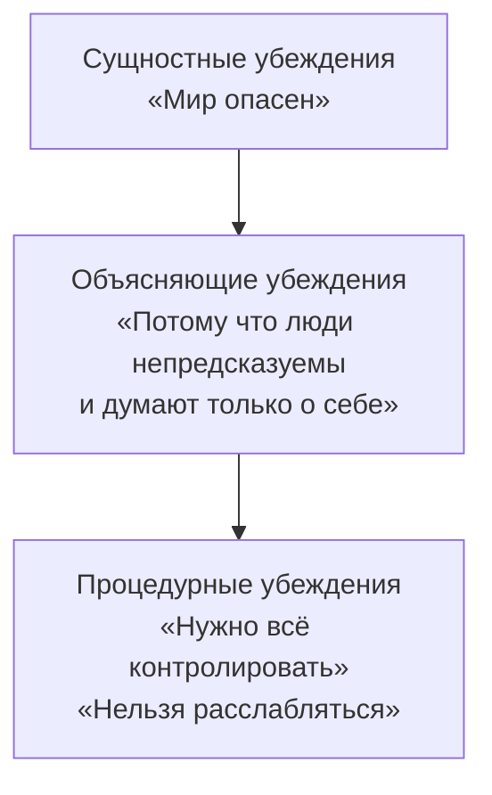

# Что такое убеждение

<small>[↑ К оглавлению](/) · [Далее: Ограничивающие убеждения →](beliefs-limiting.md)</small>

🟡 Средний · ⏱ 8 мин

*Два человека выросли в одном дворе, учились в одной школе, работают в одной компании. Один берётся за сложные проекты, второй обходит их стороной. Разница — не в навыках. Разница — в том, что каждый из них «знает» о мире, о людях и о себе.*

<details><summary><b>Кратко</b></summary>

- Убеждение — обобщение, которое человек считает истинным; «считать истинным» — кинестетический сигнал, а не логическая операция
- Три каскадных уровня (классификация А. Плигина): сущностные → объясняющие → процедурные
- Сущностные — глубинные «прошивки» о себе и мире: «мир опасен», «я недостаточно хорош»
- Объясняющие — почему мир устроен именно так: «потому что люди эгоистичны»
- Процедурные — что следует делать: «нужно всё контролировать», «нельзя показывать слабость»
- Каскад работает сверху вниз: сущностное порождает объяснения, объяснения — правила поведения

</details>

---

## Определение

Убеждение — это обобщение, которое человек считает **истинным**. Но «считать истинным» — не логическая операция. Это **кинестетический сигнал**: ощущение уверенности, «знания», твёрдости.

Структура любого убеждения:

```
Репрезентация содержания (V / A / Ad)
  → Специфические субмодальности
    → Ki (чувство уверенности)
      → Ad: «Это так»
```

Образ яркий, близкий, устойчивый — и в теле ощущение «да, это правда». Образ тусклый, далёкий, зыбкий — и в теле неуверенность, колебание. Одно и то же содержание может быть убеждением или сомнением, в зависимости от субмодальностей. Подробнее о субмодальной структуре — [Микростратегии убеждений](18_beliefs-values-structure.md).

> **Попробуйте:** Подумайте о чём-то, в чём вы абсолютно уверены — например, «я умею читать». Где этот образ? Какой яркости? Теперь подумайте о чём-то, в чём сомневаетесь. Заметьте разницу в расположении, яркости, ощущении в теле.

---

## Три уровня убеждений

Убеждения организованы в **каскад** — от глубинных к поверхностным (классификация А. Плигина). Каждый уровень порождает следующий:



### Сущностные убеждения

Сущностные убеждения — это глубинные «прошивки» о природе мира, людей и себя. Они не аргументируются, а переживаются как **очевидные факты** — «просто так устроена жизнь».

Формулируются через комплексные эквивалентности (когда два явления приравниваются: «опоздал = ненадёжный», «молчит = не согласен») и глобальные обобщения:

| Тема | Примеры |
|------|---------|
| **Мир** | «Мир опасен» · «Мир дружелюбен и полон возможностей» · «Жизнь несправедлива» · «Каждому воздаётся» |
| **Люди** | «Людям нельзя доверять» · «Люди в целом добры» · «Каждый сам за себя» · «Люди помогут, если попросить» |
| **Я** | «Я недостаточно хорош» · «Я справлюсь с чем угодно» · «Опасно проявлять себя» · «Я заслуживаю хорошего» |

Два подвида сущностных убеждений заслуживают отдельного внимания — у них свои маркеры, и их легко принять за «просто факты».

**Убеждения об идентичности** — глубинные «прошивки», направленные на самоопределение. Формулируются через самоприписывание категории:

| Маркер | Примеры |
|--------|---------|
| **«Я — [тип]»** | «Я интроверт» · «Я не лидер» · «Я технарь, не гуманитарий» |
| **«Это (не) моё»** | «Публичные выступления — это не моё» · «Бизнес — не для меня» |
| **«Я не из тех, кто...»** | «Я не из тех, кто рискует» · «Я не из тех, кому везёт» |
| **«Такой уж я»** | «Я просто такой — медленный» · «Я всегда был тревожным» |

Убеждения об идентичности особенно устойчивы, потому что человек воспринимает их не как *мнение о себе*, а как *описание себя* — как цвет глаз или рост. «Я не лидер» звучит не как убеждение, а как факт.

**Убеждения о способностях** — определяют не *кто я*, а *что я могу*. Но когда они генерализованы («мне не дано», «я не способен к такому»), это та же глубинная «прошивка» о себе:

| Маркер | Примеры |
|--------|---------|
| **«Мне (не) дано»** | «Мне не дано рисовать» · «У меня нет слуха» · «Мне дано работать с людьми» |
| **«Я (не) способен»** | «Я не способен к математике» · «Я не могу выступать на публике» |
| **«У меня (не) получается»** | «У меня никогда не получалось с языками» · «У меня руки не из того места» |
| **«Это выше моих сил»** | «Я не потяну такой проект» · «Это слишком сложно для меня» |

Отличие от процедурных: «у меня не получится сдать *этот* экзамен» — ситуативное, процедурное. «У меня *никогда* не получается *такое*» — генерализованное, сущностное. Маркер границы — кванторы общности («никогда», «всегда», «вообще») и отсутствие привязки к конкретной ситуации.

Сущностное убеждение обычно **не осознаётся** — как вода для рыбы. Человек с убеждением «мир опасен» не формулирует его: он просто живёт так, будто это правда, и удивляется, когда другие ведут себя иначе.

**Откуда они берутся.** Из раннего опыта, значимых событий, семейной системы. Ребёнок, который вырос в непредсказуемой среде (сегодня хвалят, завтра наказывают за то же самое), формирует «мир непредсказуем». Ребёнок, которого стабильно поддерживали, формирует «мир безопасен». Это не сознательный выбор — это обобщение тысяч эпизодов опыта.

> **Попробуйте:** Завершите три фразы, не задумываясь:
> - «Этот мир — ...»
> - «Люди в целом — ...»
> - «Я — человек, который — ...»
>
> Первые ответы, которые приходят, — ближе всего к сущностным убеждениям.

### Объясняющие убеждения

Объясняющие убеждения отвечают на вопрос **«почему мир устроен именно так?»**. Они выстраивают логику, которая делает сущностное убеждение «обоснованным» и непротиворечивым.

Если сущностное убеждение — это *что* (мир опасен), то объясняющее — *почему* (потому что люди непредсказуемы, потому что удача не на моей стороне, потому что за хорошим всегда следует плохое).

**Примеры каскада:**

Сущностное: **«Мир опасен»**
- «Потому что люди думают только о себе»
- «Потому что стоит расслабиться — и случится что-то плохое»
- «Потому что никто не поможет, когда будет трудно»

Сущностное: **«Я недостаточно хорош»**
- «Потому что умные люди не делают таких ошибок»
- «Потому что у других получается легко, а мне приходится стараться»
- «Потому что если бы я был достаточно хорош — меня бы ценили больше»

Сущностное: **«Жизнь несправедлива»**
- «Потому что успех зависит от связей, а не от труда»
- «Потому что одним всё, а другим ничего»
- «Потому что правила работают только для тех, кто наверху»

Обратите внимание: объясняющие убеждения содержат причинно-следственные связи («потому что», «из-за того что», «ведь»). Они создают **внутреннюю непротиворечивость** — человеку не нужно каждый раз заново убеждаться, что мир опасен, потому что у него есть целая система объяснений.

Спросите «почему?» — и человек выдаст вам слой объясняющих убеждений. Спросите «почему?» к каждому из них — доберётесь до сущностного.

> **Попробуйте:** Возьмите одно из сущностных убеждений, которое нашли в предыдущем упражнении. Спросите себя: «Почему я так считаю?» Запишите 3-4 ответа. Это ваши объясняющие убеждения.

### Процедурные убеждения

Процедурные убеждения отвечают на вопрос **«что с этим делать?»**. Они переводят картину мира в правила поведения.

Характерные маркеры: модальные слова **«должен»**, **«нужно»**, **«следует»**, **«нельзя»**, **«опасно»**, **«чтобы ... нужно ...»**.

**Примеры каскада:**

| Сущностное | Объясняющее | Процедурное |
|------------|-------------|-------------|
| «Мир опасен» | «Люди непредсказуемы» | «Нужно всё контролировать» · «Нельзя расслабляться» · «Надо всегда иметь план Б» |
| «Я недостаточно хорош» | «Ошибки — признак слабости» | «Нужно делать всё идеально» · «Нельзя показывать, что не знаешь» · «Надо работать больше других» |
| «Опасно проявлять себя» | «Тех, кто высовывается, бьют» | «Не следует привлекать внимание» · «Лучше промолчать» · «Чтобы быть в безопасности, нужно быть незаметным» |
| «Мир дружелюбен» | «Люди отвечают добром на добро» | «Можно просить о помощи» · «Стоит делиться идеями открыто» |

Процедурные убеждения — самый «поверхностный» и заметный слой. Именно их человек чаще всего формулирует: «я считаю, что нужно...», «я думаю, что правильно...». Но изменить процедурное убеждение, не затронув объясняющее и сущностное, — как обрезать ветку: она отрастёт снова.

**Убеждения не приговор.** Раз убеждение — это репрезентация с определёнными субмодальностями, его можно изменить: через новый опыт, через работу с субмодальностями, через изменение убеждений на более глубоком уровне каскада. Убеждения меняются и сами — под влиянием жизненных событий, отношений, среды. Подробнее — [Техники изменения](21b_beliefs-techniques.md).

> **Попробуйте:** Вспомните правило, которому вы следуете автоматически — например, «нельзя отказывать, когда просят о помощи» или «нужно всегда приходить вовремя». Спросите: «Почему?» Ответ — объясняющее убеждение. Спросите «почему?» к ответу — доберётесь до сущностного.

---

## Как каскад работает

Каскад — не просто классификация. Это **механизм**: каждый уровень порождает нижестоящий и поддерживается вышестоящим.

**Пример: Анна, менеджер проектов.**

Анна не берёт на себя лидерские задачи, хотя по компетенциям давно готова. Разберём каскад:

```
Сущностное:   «Опасно проявлять себя»
                ↓
Объясняющие:  «Тех, кто высовывается, критикуют»
              «Если ошибёшься на виду — это конец»
              «Успешных людей не любят»
                ↓
Процедурные:  «Не надо лезть вперёд»
              «Лучше сделать хорошо в тени, чем рисковать на виду»
              «Нужно дождаться, пока предложат»
                ↓
Метапрограммы: Реактивный, Внешняя референция, Мотивация ОТ
                ↓
Поведение:    Ждёт, пока позовут. Отказывается от предложений
              «возглавить». Перерабатывает в фоне.
```

Если работать только с процедурным уровнем (убедить Анну, что «можно лезть вперёд»), объясняющий уровень это обесценит: «Да, но ведь тех, кто высовывается, критикуют...» А за ним стоит сущностный: «Опасно проявлять себя» — и пока он на месте, новые процедурные правила не приживутся.

**Пример: Дмитрий, разработчик.**

Дмитрий перепроверяет свой код по пять раз и тратит на ревью вдвое больше времени, чем коллеги:

```
Сущностное:   «Я недостаточно хорош»
                ↓
Объясняющие:  «Хорошие разработчики не делают ошибок»
              «Если найдут баг — поймут, что я не тяну»
                ↓
Процедурные:  «Нужно проверять всё по несколько раз»
              «Нельзя отправлять, пока не уверен на 100%»
                ↓
Метапрограммы: Детальный, Различие (на себя), Мотивация ОТ
                ↓
Поведение:    Перепроверяет, затягивает, не просит ревью
```

**Пример: Марина, тимлид.**

Каскад работает и в «помогающую» сторону. Марина легко делегирует, спокойно принимает ошибки команды и быстро переключается с неудач:

```
Сущностное:   «Люди способны расти, если им доверять»
                ↓
Объясняющие:  «Ошибки — часть обучения, не катастрофа»
              «Человек лучше работает, когда чувствует доверие»
                ↓
Процедурные:  «Можно отдать задачу и не контролировать каждый шаг»
              «Если человек ошибся — стоит разобрать, а не наказать»
                ↓
Метапрограммы: Мотивация К, Глобальный, Внутренняя референция
                ↓
Поведение:    Делегирует, даёт пространство, обсуждает ошибки
              спокойно, фокусируется на развитии команды.
```

Каскад — нейтральный механизм. Он может фиксировать и ограничения, и ресурсы.

> **Попробуйте:** Выберите поведение, которое вам мешает, *и* поведение, которое у вас хорошо получается. Поднимитесь по каскаду для каждого. Какие убеждения стоят за тем и за другим?

---

## О терминологии

В классической психологии термин **«установка»** используется по-разному. В грузинской школе Узнадзе установка — это неосознанная готовность к определённой реакции. В социальной психологии установка (attitude) — это оценочное отношение к объекту. В когнитивной терапии Бека есть близкая иерархия: **глубинные убеждения** (core beliefs) → **промежуточные убеждения** (intermediate beliefs, включая правила и предположения) → **автоматические мысли**.

Каскадная классификация, которую мы используем (А. Плигин), ближе всего к модели Бека, но описывает убеждения через призму НЛП — через репрезентации, субмодальности и кинестетические отклики. Это не конкурирующие модели, а разные языки описания одного явления. Мы используем термин **«сущностные убеждения»** вместо «глубинные установки», чтобы избежать путаницы с другими значениями слова «установка».

---

## Связанные материалы

- [Ограничивающие убеждения](beliefs-limiting.md) — когда убеждение мешает, три паттерна Дилтса, как распознать
- [Как моделировать убеждения](beliefs-modeling.md) — лингвистические маркеры, анализ текста, восстановление каскада
- [Что такое ценность](../values/values-intro.md) — как ценности управляют метапрограммами и чем отличаются от убеждений
- [Убеждения, ценности и метапрограммы](17_beliefs-and-metaprograms.md) — механизм фиксации, кластеры, иерархия уровней
- [Микростратегии убеждений](18_beliefs-values-structure.md) — субмодальная структура убеждения vs сомнения
- [Техники изменения](21b_beliefs-techniques.md) — субмодальный перенос и музей старых убеждений
- [Упражнения](21c_beliefs-exercises.md) — от калибровки до разрыва цикла подтверждения

---

**Далее:** [Ограничивающие убеждения](beliefs-limiting.md) — когда убеждение мешает и как это распознать

← [Встраивание метапрограмм: продвинутое](../metaprograms/13c_installation-advanced.md)
