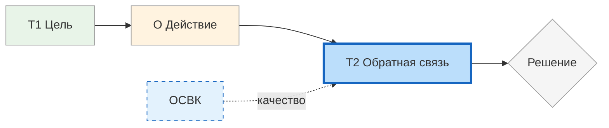

# ОСВК: обратная связь, которая улучшает

<small>← [Вопросы для проработки цели](../goal-spec/07_goal-spec-questions.md) · [Далее: Три позиции восприятия →](08a_positions.md)</small>

🟢 Базовый · ⏱ 5 мин

*Вы даёте обратную связь — коллега кивает. Через неделю всё по-старому. Проблема не в нём — в форме обратной связи.*

<b>Кратко</b>

- ОСВК — обратная связь, направленная на улучшение, а не на оценку
- Формула: что сделано хорошо + что можно добавить + как
- Два аспекта: содержание (что сообщать) и форма (как доносить)
- ОСВК наполняет содержанием элемент T2 в модели T.O.T.E.

---

**ОСВК** — это информация о результатах действия, данная в такой форме и последовательности, в которых она наиболее полно может быть использована для улучшения системы.

Ключевое слово — **улучшение**. Цель ОСВК не в том, чтобы оценить, похвалить или покритиковать. Цель — дать системе (человеку, команде, процессу) данные, которые она сможет использовать для коррекции своего поведения.

### Формула ОСВК

> **Что было сделано хорошо — и что (и как) можно добавить в следующий раз.**

Эта формула — ядро ОСВК. Всё остальное — принципы, позиции, стратегии — служит тому, чтобы донести эти две части максимально эффективно.

| Часть формулы | Зачем нужна | Что даёт получателю |
|---------------|-------------|---------------------|
| **Что сделано хорошо** | Выявить работающие паттерны | Понимание, что сохранить и усилить |
| **Что можно добавить** | Указать направление роста | Конкретный следующий шаг |
| **Как добавить** | Сделать улучшение реализуемым | Способ действия, а не абстракцию |

### Два аспекта ОСВК

| Аспект | Вопрос | Что включает |
|--------|--------|--------------|
| **Содержание** | *Что* сообщать? | Какую информацию отобрать, на чём сфокусировать внимание |
| **Форма** | *Как* доносить? | Последовательность, позиция, формулировки, контекст |

Одно без другого не работает: точная информация, поданная неудачно, вызовет защиту и будет отвергнута. Удачная форма без полезного содержания — пустая трата времени.

**Принципы** обеспечивают правильную форму. **Позиции восприятия** дают инструменты для подачи. Формула задаёт структуру содержания.

> **Попробуйте:** Вспомните последний случай, когда вы давали кому-то обратную связь. Что в вашем подходе относилось к содержанию, а что — к форме?

---

## Связь с T.O.T.E.

В модели T.O.T.E. обратная связь — это содержание элемента **T2** (проверка). После выполнения операции (O) система сравнивает результат с желаемым состоянием (T1) и принимает решение: продолжить цикл или выйти.

**Низкокачественная обратная связь** искажает картину: система не понимает, что именно работает, а что нет. Цикл буксует или идёт в ложном направлении.

**Высококачественная обратная связь** даёт точную информацию о разрыве между текущим и желаемым состоянием, а также о том, какие действия этот разрыв увеличивают или уменьшают.

> **Попробуйте:** Выберите одну повторяющуюся задачу в вашей работе и проследите: какую обратную связь вы получаете после её выполнения? Помогает ли она улучшить результат в следующий раз?

---

## Страницы раздела

| Страница | Тема |
|----------|------|
| **Вы здесь** | Что такое ОСВК, формула, связь с T.O.T.E. |
| [Три позиции восприятия](08a_positions.md) | Я, Другой, Наблюдатель — три точки зрения на ситуацию |
| [8 принципов ОСВК](08b_principles.md) | Правила подачи обратной связи |
| [ОСВК на практике](08c_practice.md) | Примеры, самообратная связь, чек-лист |
| [Стратегии ОСВК](09_osvk-methods.md) | Развёрнутые стратегии и алгоритмы |

---

**Далее:** [Три позиции восприятия](08a_positions.md) — Я, Другой, Наблюдатель

← [Вопросы для проработки цели](../goal-spec/07_goal-spec-questions.md)
