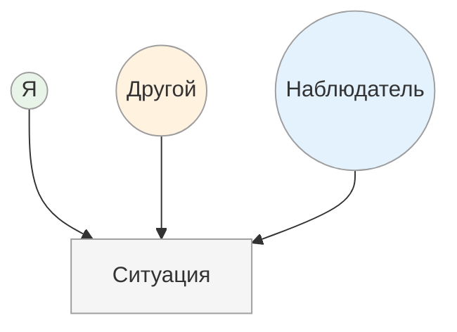

# Три позиции восприятия

<small>← [ОСВК: обзор](08_osvk-overview.md) · [Далее: 8 принципов ОСВК →](08b_principles.md)</small>

🟢 Базовый · ⏱ 4 мин

*Конфликт на встрече. С вашей позиции — вы правы. С его — он прав. С позиции наблюдателя — оба частично правы. Три позиции — три разных «правды».*

<b>Кратко</b>

- 1-я позиция (Я) — личный опыт, субъективность
- 2-я позиция (Другой) — эмпатия, понимание мотивов
- 3-я позиция (Наблюдатель) — объективность, факты без оценок
- Для ОСВК ключевая — 3-я позиция, но все три полезны

---

Чтобы давать ОСВК эффективно, нужно уметь смотреть на ситуацию с разных точек зрения. Особенно важна **3-я позиция (Наблюдатель)** — именно из неё строится большая часть обратной связи. Но понимание всех трёх позиций позволяет гибко выбирать подход в зависимости от ситуации.

### 1-я позиция: Я

Своя личная, субъективная точка зрения. То, что **вы** видите, слышите, чувствуете.

**Маркеры речи:**
- «Я заметил...»
- «Мне показалось...»
- «Я почувствовал...»
- «На меня это произвело впечатление...»

**Ценность:** честность, личная включённость, эмоциональный контакт.

**Ограничение:** субъективность, возможная предвзятость.

### 2-я позиция: Другой

«Влиться» в другого человека. Посмотреть на происходящее **его глазами**, представить его мысли и чувства.

**Маркеры речи:**
- «Если бы я был на твоём месте, я бы, возможно, подумал...»
- «С точки зрения клиента это могло выглядеть как...»
- «Представь: ты сидишь там и видишь...»

**Ценность:** эмпатия, понимание мотивов, снятие защит («он меня понимает»).

**Ограничение:** это гипотеза, а не факт — важно это оговаривать.

### 3-я позиция: Наблюдатель

Максимально отстраниться от всех участников. Смотреть на ситуацию как на видеозапись — нейтрально, без личных оценок и эмоций.

**Маркеры речи:**
- «Со стороны это выглядело так...»
- «Наблюдатель бы заметил, что...»
- «Если посмотреть на запись...»
- «Объективно произошло следующее...»

**Ценность:** объективность, отделение фактов от интерпретаций, снижение эмоционального накала.

**Ограничение:** может восприниматься как холодность, если использовать только эту позицию.

> **Попробуйте:** Опишите любую недавнюю ситуацию из трёх позиций по очереди: что видели вы (1-я), что мог видеть другой участник (2-я), что зафиксировала бы видеокамера (3-я).

---

**Далее:** [8 принципов ОСВК](08b_principles.md) — правила подачи обратной связи

← [ОСВК: обзор](08_osvk-overview.md)
