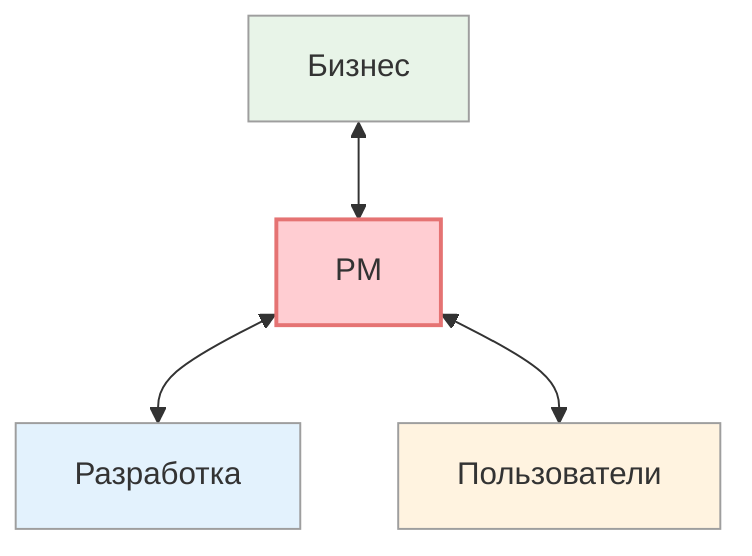

# Системное мышление для Project Manager'а

<small>[↑ К оглавлению](/) · [Далее: Что такое системное мышление →](01_system-thinking-basics.md)</small>

🟢 Базовый · ⏱ 4 мин

*«Бизнес говорит одно, разработчики слышат другое.» Если узнали — эта методичка для вас.*

<b>Кратко</b>

- 80% работы PM'а — коммуникация; большинство проблем — из-за разных фильтров восприятия
- 5 инструментов: метапрограммы, T.O.T.E., спецификация цели, ОСВК, цикл обучения
- Таблица «проблема PM'а → инструмент» — быстрый навигатор

---

## Знакомые проблемы?

- «Бизнес говорит одно, разработчики слышат другое»
- «Не могу донести цель так, чтобы все поняли одинаково»
- «Даю обратную связь — люди обижаются или игнорируют»
- «Стейкхолдеры как будто говорят на разных языках»
- «Сам иногда не понимаю, чего на самом деле хочет заказчик»
- «Требования меняются — проект буксует»
- «Риски всплывают в последний момент»

Если узнали хотя бы одно — эта методичка для вас.

---

## PM на стыке миров

Project Manager работает на пересечении разных «миров»:

Каждый мир говорит на своём языке, видит свою часть картины, имеет свои приоритеты.

**Бизнес** думает о результатах, сроках, деньгах. **Разработка** — о процессах, технических ограничениях, качестве кода. **Пользователи** — о своих задачах и удобстве. И каждый уверен, что его картина — единственно верная.

80% работы PM'а — коммуникация. И большинство проблем возникает не из-за нехватки информации, а из-за того, что люди **по-разному обрабатывают** одну и ту же информацию.

Эта методичка — про то, как понимать эти различия и работать с ними.

---

## Что даёт эта методичка

| Проблема PM'а | Инструмент | Как помогает |
|---------------|------------|--------------|
| **Бизнес и разработка говорят на разных языках** | [Метапрограммы](../metaprograms/10_metaprograms-intro.md) | Понять, что бизнес мыслит «глобально + результаты + будущее», а разработчик — «детально + процессы + настоящее». Адаптировать речь под каждого. |
| **Не могу донести цель понятно** | [Спецификация цели](../goal-spec/06_goal-spec.md) + [Метапрограммы](../metaprograms/10_metaprograms-intro.md) | 9 вопросов превращают «хотелку» в конкретную цель. Метапрограммы показывают, как объяснить эту цель разным людям. |
| **Обратная связь не работает** | [ОСВК](../feedback/08_osvk-overview.md) | 8 принципов + три позиции восприятия. Обратная связь, которую слышат и используют, а не отвергают. |
| **Стейкхолдеры конфликтуют** | [ОСВК](../feedback/08_osvk-overview.md) + [Метапрограммы](../metaprograms/10_metaprograms-intro.md) | Три позиции восприятия — инструмент медиации. Конфликтующие метапрограммы объясняют, *почему* люди не понимают друг друга. |
| **Требования меняются** | [Метапрограммы](../metaprograms/10_metaprograms-intro.md) + [T.O.T.E.](../tote/04_tote-overview.md) | Понять причину изменений. T.O.T.E. — итеративный подход, где изменения — часть цикла. |
| **Риски всплывают поздно** | [Метапрограммы](../metaprograms/10_metaprograms-intro.md) | Сознательно «включить» метапрограмму «ОТ» и «Различие». Привлечь людей с этими метапрограммами к анализу. |

---

## Страницы раздела

| Страница | Тема |
|----------|------|
| **Вы здесь** | Введение, проблемы PM'а, навигатор |
| [Что такое системное мышление](01_system-thinking-basics.md) | Принципы, отличие от линейного мышления |
| [Инструменты методички](02_tools-overview.md) | Краткий обзор 5 инструментов и их связи |
| [Границы ответственности](03_boundaries.md) | Что методичка НЕ решает |
| [Полезно не только PM'ам](04_for-other-roles.md) | Для архитекторов, аналитиков, разработчиков, тимлидов |
| [Порядок изучения](05_study-guide.md) | 3 прохода, принцип, признаки прогресса |

---

**Далее:** [Что такое системное мышление](01_system-thinking-basics.md) — ключевые принципы
