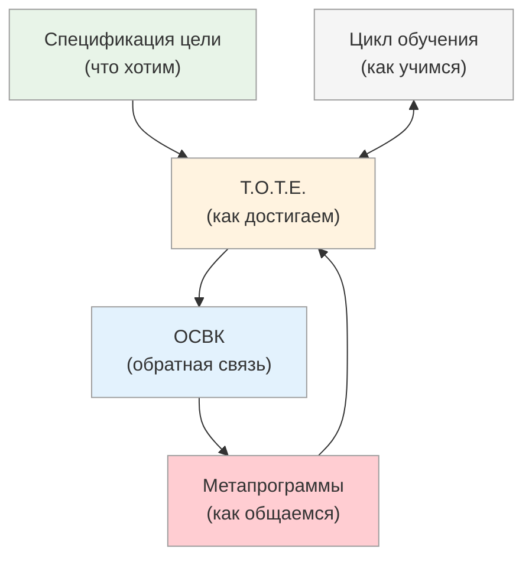

# Инструменты методички: краткий обзор

<small>← [Системное мышление](01_system-thinking-basics.md) · [Далее: Границы ответственности →](03_boundaries.md)</small>

🟢 Базовый · ⏱ 5 мин

*5 инструментов, которые покрывают 80% коммуникационных задач PM'а.*

<b>Кратко</b>

- Цикл обучения — понять, на какой стадии находится команда
- T.O.T.E. — итеративный подход к достижению результата
- Спецификация цели — превратить «хотелку» в конкретную цель
- ОСВК — обратная связь, которую слышат и используют
- Метапрограммы — почему люди видят и слышат разное

---

### Цикл обучения

Как эффективно учиться и учить.

- **[Кривая забывания](../learning-cycle/01_forgetting-curve.md)** — почему мы забываем и как с этим работать
- **[4 стадии компетентности](../learning-cycle/02_learning.md)** — путь от «не знаю, что не знаю» до автоматизма
- **[Кривая Бандуры](../learning-cycle/03_bandura.md)** — эмоциональные этапы освоения навыка, кризисы и как их проходить

**Для PM'а:** понимание, на какой стадии находится команда или отдельный человек. Почему новичок «тормозит», а эксперт «не может объяснить».

### Модель T.O.T.E.

Универсальная модель достижения результата.

- **[Описание модели](../tote/04_tote-overview.md)** — цикл: Цель → Действие → Проверка → Корректировка или Выход
- **[Вопросы для моделирования](../tote/05_tote-questions.md)** — как выяснить T.O.T.E. эксперта

**Для PM'а:** итеративный подход к проекту. Понимание, что «изменения требований» — не провал, а нормальная часть цикла T2 (проверка).

### Спецификация цели

Как превратить размытое «хочу» в конкретную цель.

- **[9 пунктов](../goal-spec/06_goal-spec.md)** — критерии хорошо сформулированной цели
- **[Вопросы](../goal-spec/07_goal-spec-questions.md)** — как выяснить эти пункты у заказчика

**Для PM'а:** инструмент для работы с требованиями. 9 вопросов, которые превращают «сделайте нам хорошо» в конкретное ТЗ.

### Обратная связь высокого качества (ОСВК)

Как давать обратную связь, которую слышат и используют.

- **[ОСВК](../feedback/08_osvk-overview.md)** — формула «что хорошо + что добавить», связь с T.O.T.E.
- **[Три позиции восприятия](../feedback/08a_positions.md)** — Я, Другой, Наблюдатель
- **[8 принципов](../feedback/08b_principles.md)** — правила подачи обратной связи
- **[Практика и примеры](../feedback/08c_practice.md)** — примеры, самообратная связь, чек-лист
- **[Дополнительные способы](../feedback/09_osvk-methods.md)** — сократический метод, письменная ОСВК, совместный просмотр записи

**Для PM'а:**
- Обратная связь команде, которая развивает, а не демотивирует
- Три позиции восприятия — инструмент для разрешения конфликтов и медиации
- Принципы деэскалации в сложных разговорах

### Метапрограммы

Фильтры восприятия — почему люди видят и слышат разное.

- **[Метапрограммы](../metaprograms/10_metaprograms-intro.md)** — 10 категорий фильтров восприятия с подстройкой
- **[Взаимодействия метапрограмм](../metaprograms/10k_interactions.md)** — конфликты, синергия, алгоритм работы

**Для PM'а:** ключевой инструмент. Объясняет, почему бизнес и разработка «не понимают друг друга» — они буквально обрабатывают информацию по-разному. Даёт способ «переводить» между мирами.

---

## Как инструменты связаны

**Спецификация цели** задаёт T1 (желаемое состояние) для **T.O.T.E.**

**T.O.T.E.** — цикл достижения: действие → проверка → корректировка. **ОСВК** наполняет содержанием этап проверки (T2).

**Метапрограммы** пронизывают всё: как формулировать цель для разных людей, как давать обратную связь, как общаться на каждом этапе.

**Цикл обучения** объясняет, почему освоение этих инструментов требует времени и практики.

---

**Далее:** [Границы ответственности](03_boundaries.md) — что методичка НЕ решает

← [Системное мышление](01_system-thinking-basics.md)
