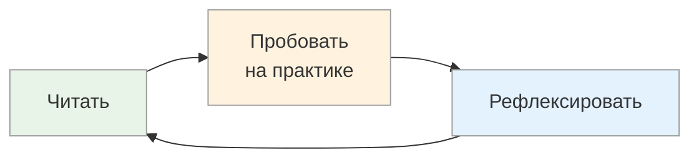

# Как пользоваться методичкой: порядок изучения

<small>← [Другие роли](04_for-other-roles.md) · [Далее: К основному маршруту → Кривая забывания →](../learning-cycle/01_forgetting-curve.md)</small>

🟢 Базовый · ⏱ 4 мин

*Не пытайтесь освоить всё сразу. Один инструмент в неделю — и через месяц качество коммуникации изменится.*

<b>Кратко</b>

- 3 прохода: основы → углубление → продвинутое
- Принцип: читать → пробовать → рефлексировать → повторить
- 4 признака прогресса
- 6 ключевых идей методички

---

## Рекомендуемый порядок изучения

**Первый проход — основы:**

1. [Метапрограммы](../metaprograms/10_metaprograms-intro.md) — ключевой инструмент для PM'а
2. [ОСВК](../feedback/08_osvk-overview.md) — обратная связь и разрешение конфликтов
3. [Спецификация цели](../goal-spec/06_goal-spec.md) — работа с требованиями

**Второй проход — углубление:**

1. [T.O.T.E.](../tote/04_tote-overview.md) — модель достижения + [Встраивание T.O.T.E.-мышления](../tote/06a_tote-install-intro.md)
2. [Цикл обучения](../learning-cycle/02_learning.md) + [Кривая Бандуры](../learning-cycle/03_bandura.md) — для работы с командой
3. [Дополнительные методы ОСВК](../feedback/09_osvk-methods.md)
4. [Спецификация цели: вопросы](../goal-spec/07_goal-spec-questions.md)

**Третий проход — для продвинутых (развитие собственной гибкости):**

1. [Встраивание метапрограмм](../metaprograms/13a_installation-basics.md) — развитие гибкости в переключении между полюсами
2. [Мышление по аналогии](../microstrategies/15_analogy-training.md) + [Встраивание](../microstrategies/20_analogy-installation.md)
3. [Тренировка врат сортировки](../microstrategies/16_sorting-gates-training.md) + [Встраивание](../microstrategies/19a_gates-exercises.md)
4. [Убеждения, ценности и метапрограммы](../beliefs/17_beliefs-and-metaprograms.md)
5. [Микростратегии убеждений и ценностей](../beliefs/18_beliefs-values-structure.md)
6. [Встраивание через микростратегии](../microstrategies/14a_what-is-microstrategy.md)
7. [Встраивание работы с убеждениями](../beliefs/21a_beliefs-program.md)

## Принцип изучения

Не пытайтесь освоить всё сразу. Возьмите один инструмент и практикуйте его неделю:
- Метапрограммы — калибруйте в каждом разговоре
- ОСВК — применяйте принципы при любой обратной связи
- Спецификация цели — используйте при сборе требований

## Признаки прогресса

- Начинаете замечать метапрограммы собеседников автоматически
- Конфликтные разговоры становятся менее напряжёнными
- Требования становятся конкретнее с первого раза
- Обратная связь воспринимается командой как помощь, а не критика

---

## Ключевые идеи

1. **80% проблем PM'а — коммуникация.** Люди по-разному обрабатывают информацию. Это не вредность, это фильтры восприятия.

2. **Нет «правильного» способа видеть.** Бизнес не «хуже» разработки, просто другой фокус. Цель — интегрировать разные точки зрения.

3. **Подстройка — не манипуляция.** Это уважение к собеседнику: говорить на его языке, а не требовать, чтобы он учил ваш.

4. **Обратная связь — топливо для системы.** Низкокачественная — шум и искажения. Высококачественная — точная коррекция курса.

5. **Границы ответственности — это здорово.** Понимать, что вне вашего контроля — освобождает энергию для того, что внутри.

6. **Гибкость важнее силы.** Умение переключаться между метапрограммами ценнее, чем быть «экспертом» в одной.

---

## Связь с другими материалами

Эта методичка — практические инструменты. Для более глубокого погружения в системное мышление:

- Системная инженерия и системное мышление — теоретическая база
- НЛП (нейролингвистическое программирование) — источник метапрограмм, ОСВК, спецификации цели
- Кибернетика — источник понятия обратной связи и модели T.O.T.E.

---

> **Начните с малого:** на следующей встрече попробуйте определить 2-3 метапрограммы ключевого стейкхолдера. Это уже изменит качество коммуникации.

---

**Далее:** [К основному маршруту → Кривая забывания](../learning-cycle/01_forgetting-curve.md) — начните изучение инструментов

← [Другие роли](04_for-other-roles.md)
