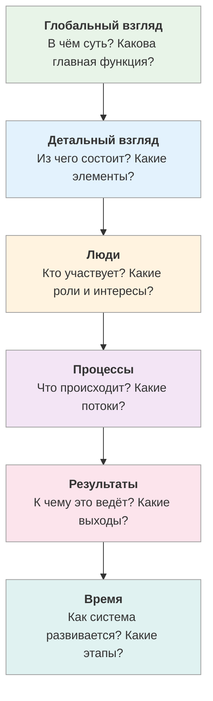

# Метапрограммы

<small>← [Дополнительные способы ОСВК](../feedback/09_osvk-methods.md) · [Далее: Фокус сравнений →](10a_comparison.md)</small>

🟢 Базовый · ⏱ 7 мин

*Два человека слышат одно и то же — и делают разное. Не потому что один глупый. У них разные фильтры восприятия — метапрограммы. Понимание этих фильтров меняет качество коммуникации.*

<b>Кратко</b>

- Метапрограммы — фильтры, через которые мы воспринимаем реальность
- У каждого человека свой профиль метапрограмм — своя «оптика»
- Осознание фильтров помогает видеть слепые зоны
- Подстройка по метапрограммам = общение на языке собеседника
- 10 метапрограмм: от фокуса сравнений до убедителей

---

**Метапрограммы** — это характерные способы концентрации нашего внимания в окружающем и внутреннем мире. Они работают как избирательные фильтры в процессе выработки приоритетов: какую информацию выделить как значимую, а какую — исключить.

У каждой метапрограммы есть два или более вариантов, направляющих наше внимание на альтернативные аспекты реальности. Каждый человек имеет свою конкретную комбинацию метапрограмм (профиль), что сказывается на особенностях его восприятия, характера, поведения и привычек.

Умение определять метапрограммный профиль собеседника даёт возможность точнее понимать его предпочтения и создавать более эффективную коммуникацию. Развитие гибкости в использовании различных метапрограмм позволяет расширить возможности собственного восприятия.

Каждая метапрограмма описывается как **шкала между полюсами**. Человек может находиться ближе к одному полюсу, к другому, или в середине — в зависимости от контекста.

---

## Зачем метапрограммы системному мыслителю

Метапрограммы — это фильтры, через которые мы воспринимаем реальность. Для системного мышления это имеет фундаментальное значение.

### 1. Осознание ограничений собственного восприятия

Каждый человек видит только часть системы — ту, которую пропускают его метапрограммные фильтры. Если ваша ведущая метапрограмма — «Результаты», вы отлично видите цели и итоги, но можете упускать людей и их отношения. Если «Детальный» — видите элементы, но теряете общую картину.

Системное мышление требует **полноты картины**. Осознавая свои фильтры, вы понимаете, что именно можете не замечать.

### 2. Множественность описаний системы

Один из принципов системного мышления: любая сложная система требует множественного описания. Метапрограммы дают естественную структуру для этого:

| Метапрограмма | Какой аспект системы описывает |
|---------------|-------------------------------|
| **Люди** | Стейкхолдеры, роли, отношения |
| **Ценности / Результаты** | Цели системы, её назначение |
| **Процессы** | Потоки, преобразования, динамика |
| **Вещи** | Элементы, ресурсы, инструменты |
| **Время** | Жизненный цикл, этапы, ритмы |
| **Место** | Границы, среда, контекст |
| **Глобальный / Детальный** | Уровни системной иерархии |

Переключаясь между метапрограммами, вы получаете разные «срезы» одной системы — как разные проекции трёхмерного объекта.

### 3. Понимание, почему другие видят иначе

В любой системе участвуют люди с разными метапрограммными профилями. Человек с профилем «Глобальный + Результаты» и человек с профилем «Детальный + Процессы» буквально **видят разные системы**, глядя на один и тот же проект.

Это не вопрос правоты — это вопрос фильтров. Понимание этого снимает конфликты и позволяет интегрировать разные точки зрения в более полную картину.

### 4. Эффективная коммуникация в системе

Система работает через коммуникацию между её элементами. Если вы не можете донести информацию до человека с другими метапрограммами, вы создаёте «разрыв» в системе. Подстройка по метапрограммам — это способ **сохранять связность системы** через эффективную коммуникацию.

### Метапрограммы как инструмент анализа

При анализе системы полезно сознательно «примерять» разные метапрограммы:

Такой обход помогает не упустить важные аспекты системы.

### Связь с позициями восприятия

Метапрограммы связаны с позициями восприятия:

| Позиция | Типичные метапрограммы |
|---------|------------------------|
| **1-я (Я)** | Внутренняя референция, Кинестетика |
| **2-я (Другой)** | Внешняя референция на других, Люди |
| **3-я (Наблюдатель)** | Дигитальная система*, Глобальный, Обобщение |
| **4-я (Система)** | Референция на контекст, Ценности, Время |

> Дигитальная (аудиально-дигитальная) система — обработка информации через слова, логику, факты и категории, в отличие от образов (визуальная), звуков (аудиальная) и ощущений (кинестетическая).

Переход между позициями часто означает и переключение метапрограмм.

### Практическое применение

> **Примечание.** Распознать собственные метапрограммы бывает непросто — привычные фильтры «невидимы» изнутри, как акцент в родном языке. Если не получается определить свой профиль самостоятельно — спросите коллегу, друга или партнёра: со стороны метапрограммы видны значительно лучше.

**Для анализа проблемы:**
1. Опишите проблему со своей естественной метапрограммой
2. Переопишите её с противоположной метапрограммой
3. Найдите, что нового даёт второе описание

**Для принятия решения:**
1. Оцените решение с позиции «К» (что получим?)
2. Оцените с позиции «ОТ» (чего избежим / что потеряем?)
3. Интегрируйте оба взгляда

**Для коммуникации в команде:**
1. Определите метапрограммный профиль участников
2. Адаптируйте подачу информации под каждого
3. Включите в презентацию все ключевые «языки»

---

## Карта метапрограмм

| № | Метапрограмма | Полюса | Страница |
|---|--------------|--------|----------|
| 1 | Фокус сравнений | Сходство ↔ Различие | [10a](10a_comparison.md) |
| 2 | Мотивация | Приближение К ↔ Избегание ОТ | [10b](10b_motivation.md) |
| 3 | Референция | Внутренняя ↔ Понимание ↔ Другие ↔ Система | [10c](10c_reference.md) |
| 4 | Врата сортировки | Люди • Ценности • Процессы • Вещи • Время • Место | [10d](10d_sorting-gates.md) |
| 5.А | Размер блока | Глобальный ↔ Детальный | [10e1](10e1_chunk-size.md) |
| 5.Б | Способ мышления | Обобщение ↔ Детализация ↔ Аналогия | [10e2](10e2_thinking-style.md) |
| 5.В | Репрезентативная система | Визуальная • Аудиальная • Кинестетическая • Дигитальная | [10e3](10e3_rep-systems.md) |
| 6 | Ориентация во времени | Прошлое ↔ Настоящее ↔ Будущее / Включённое ↔ Сквозное | [10f](10f_time.md) |
| 7 | Убедители | Интенсивность • Число раз • Частота • Период • Интервал | [10g](10g_convincers.md) |
| 8 | Проактивный ↔ Реактивный | Инициирует ↔ Анализирует | [10h](10h_proactive-reactive.md) |
| 9 | Опции ↔ Процедуры | Выбирает ↔ Следует плану | [10i](10i_options-procedures.md) |
| 10 | Самостоятельный ↔ Командный | Один ↔ В группе ↔ Координирует | [10j](10j_solo-team.md) |

> 🔗 **Взаимодействие метапрограмм** — конфликты, синергия, алгоритм подстройки: [10k](10k_interactions.md)

---

**Далее:** [Фокус сравнений](10a_comparison.md) — Сходство ↔ Различие

← [Дополнительные способы ОСВК](../feedback/09_osvk-methods.md)
