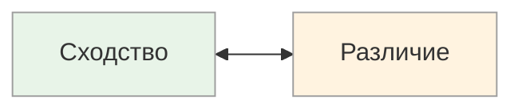

# Фокус сравнений: Сходство ↔ Различие

<small>← [Введение в метапрограммы](10_metaprograms-intro.md) · [Далее: Мотивация: К ↔ ОТ →](10b_motivation.md)</small>

🟢 Базовый · ⏱ 7 мин

*Двое смотрят на один проект — один видит «всё как всегда», другой «всё изменилось». Оба смотрят на одно и то же. Разница — в фильтре сравнений.*

<b>Кратко</b>

- Сходство — фокус на общем, паттернах, стабильности
- Различие — фокус на отличиях (конструктивное «на новое» или деструктивное «на нет»)
- Смешанные варианты: Сходство→Различие и Различие→Сходство
- Подстройка: используйте речевые паттерны собеседника
- Принцип ОСВК «Добавление, не исправление» — это различие через «новое»

---

*На что человек обращает внимание при сравнении: на похожее или на отличающееся?*

### Основные полюса

| Полюс | Фокус внимания | Типичные фразы |
|-------|----------------|----------------|
| **Сходство** | Что общего, что похоже, паттерны | «Это похоже на...», «Так же как и...», «То же самое» |
| **Различие** | Что отличается, что уникально | «А вот здесь по-другому...», «Отличие в том, что...» |

### Смешанные варианты

Большинство людей используют комбинации сходства и различия. Важно, **с чего начинают** и **к чему приходят**:

| Вариант | Описание | Типичные фразы |
|---------|----------|----------------|
| **Сходство → Различие** | Сначала видит общее, потом замечает отличия | «Каждый новый год мы встречаем со старыми друзьями, но каждый раз по-разному»; «Традиционное качество в новой упаковке» |
| **Различие → Сходство** | Сначала видит отличия, потом находит общее | «Новое — хорошо забытое старое»; «Новая должность на прежней работе»; «Иной взгляд на привычные вещи» |

### Два типа фокуса на различие

Фокус на различия может проявляться двумя принципиально разными способами:

| Тип | Что замечает | Реакция | Типичные фразы |
|-----|--------------|---------|----------------|
| **Различие на «новое»** | Что можно улучшить, развить | Конструктивная: добавление | «Хорошо, и ещё можно добавить...»; «Это отличается от всего — уникальное предложение»; «Свежее решение» |
| **Различие на «нет»** | Что не подходит, не работает | Деструктивная: отвержение | «Нет, это не то, потому что...»; «Это не сработает»; «Здесь ошибка» |

**Различие на «новое»** — продуктивный паттерн для инноваций и развития.

**Различие на «нет»** — полезен для контроля качества, но в избытке блокирует любые изменения.

> **Попробуйте:** Вспомните недавнюю идею или предложение, на которое вы отреагировали критикой. Переформулируйте свою реакцию через «различие на новое» — что можно добавить или улучшить?

### Как распознать

**Сходство (консенсус):**
- Ищет паттерны и аналогии
- Легко адаптируется к знакомым ситуациям
- Ценит традиции и проверенные решения
- Может не заметить важных отличий

**Различие (конфронтация):**
- Сразу видит, что не так
- Хорош в поиске ошибок и улучшений
- Может восприниматься как критикан

**Различие на «новое»:**
- Замечает отличия и воспринимает их как ресурс
- Интересуется тем, что можно добавить или улучшить
- Легко принимает изменения, если видит в них развитие

**Различие на «нет»:**
- Первая реакция — возражение
- Находит причины, почему что-то не сработает
- Сложно принимает новые идеи

### Применение

| Контекст | Более эффективный полюс |
|----------|-------------------------|
| Стабильная работа, поддержка | Сходство |
| Инновации, улучшения | Различие на «новое» |
| Обучение новичков (аналогии) | Сходство |
| Контроль качества, тестирование | Различие |
| Мозговой штурм | Различие на «новое» |
| Финальная проверка перед запуском | Различие на «нет» |

**Связь с ОСВК:** Принцип «Добавление, не исправление» — это работа с различием через «новое», а не через «нет».

---

## Подстройка

### Речевые паттерны

| Полюс | Примеры фраз для подстройки |
|-------|----------------------------|
| **Сходство** | «Как всегда», «По-прежнему», «Так же, как и раньше», «Похоже на то, что мы делали», «Тут то же самое, что и там», «Ничего не изменилось», «Общее у них то, что...» |
| **Различие** | «А вот тут по-другому», «Это не похоже на...», «Совсем другое дело», «Смотри, какая разница», «Отличается тем, что...», «Раньше такого не было», «Тут всё новое» |
| **Сходство → Различие** | «В целом похоже, но вот тут отличается», «Как обычно, только на этот раз...», «Принцип тот же, а детали другие» |
| **Различие → Сходство** | «Выглядит по-новому, но по сути то же самое», «Другая обёртка, а внутри всё знакомое», «Новый подход, но результат такой же» |

### Примеры подстройки

| Ситуация | Для «Сходства» | Для «Различия» |
|----------|----------------|----------------|
| Предложение нового продукта | «Он работает так же, как предыдущий — тот же интерфейс, те же кнопки, просто быстрее» | «Тут полностью переработанный интерфейс, другая архитектура, ничего общего со старым» |
| Приглашение на мероприятие | «Встречаемся там же, в том же составе, как обычно по пятницам» | «Новая площадка, новый формат, будут люди, которых раньше не было» |
| Внедрение процесса | «По сути делаем то же самое, только чуть упорядоченнее» | «Смотрите, чем это отличается от того, как было: вот тут другое, и вот тут» |

> **Попробуйте:** В следующем разговоре обратите внимание: собеседник говорит «как всегда» или «по-новому»? Подстройтесь — используйте его язык в своём ответе.

---

**Далее:** [Мотивация: К ↔ ОТ](10b_motivation.md) — Стремление к целям или избегание проблем

← [Введение в метапрограммы](10_metaprograms-intro.md)
