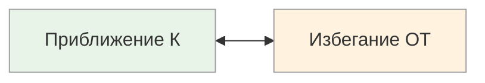

# Мотивация: К ↔ ОТ

<small>← [Фокус сравнений](10a_comparison.md) · [Далее: Референция →](10c_reference.md)</small>

🟢 Базовый · ⏱ 5 мин

*Один говорит «хочу вырасти до тимлида», другой — «хочу уйти от рутины». Одна и та же цель, два языка. Если вы мотивируете «от проблем» человека, который мыслит «к целям» — он вас не услышит.*

<b>Кратко</b>

- «К» — фокус на целях, наградах, достижениях
- «ОТ» — фокус на проблемах, рисках, угрозах
- Здоровый баланс: «К» для целей, «ОТ» для рисков
- Связь со спецификацией цели: пункт 1 (Позитивность) — переформулирование «ОТ» в «К»

---

*Что движет человеком: желание получить или страх потерять?*

| Полюс | Фокус внимания | Типичные фразы |
|-------|----------------|----------------|
| **Приближение К** | Цели, награды, достижения, позитив | «Я хочу получить...», «Это даст мне...», «Моя цель —...» |
| **Избегание ОТ** | Проблемы, риски, угрозы, негатив | «Я не хочу...», «Нужно избежать...», «Главное — не допустить...» |

### Как распознать

**Приближение К:**
- Говорит о том, чего хочет достичь
- Мотивируется наградами и возможностями
- Может недооценивать риски

**Избегание ОТ:**
- Говорит о том, чего хочет избежать
- Мотивируется угрозами и дедлайнами
- Хорошо видит потенциальные проблемы

> **Попробуйте:** Выберите одну задачу из вашего списка дел, сформулированную через «избегание» (например, «не опоздать с отчётом»). Переформулируйте её через «приближение» — чего вы хотите достичь?

### Применение

| Контекст | Более эффективный полюс |
|----------|-------------------------|
| Постановка целей | Приближение К |
| Управление рисками | Избегание ОТ |
| Долгосрочная мотивация | Приближение К |
| Соблюдение безопасности | Избегание ОТ |

### Баланс и крайности

| Полюс | При чрезмерном использовании |
|-------|------------------------------|
| **Только «К»** | Игнорирование рисков, разочарования от завышенных ожиданий, «розовые очки» |
| **Только «ОТ»** | Хронический стресс, тревожность, ощущение «бега от проблем» без движения к цели |

Здоровый баланс: **«К»** для постановки целей и долгосрочной мотивации, **«ОТ»** для оценки рисков и соблюдения границ.

**Связь со спецификацией цели:** Пункт 1 (Позитивность) — переформулирование цели из «избегания ОТ» в «стремление К».

---

## Подстройка

### Речевые паттерны

| Полюс | Примеры фраз для подстройки |
|-------|----------------------------|
| **К (приближение)** | «Это позволит вам...», «Вы сэкономите благодаря этому», «Приобретёте...», «Для достижения успеха», «Чтобы сохранить лидирующие позиции», «Получите следующие выгоды», «Чтобы испытать удовлетворение» |
| **ОТ (избегание)** | «Избежать...», «Избавиться...», «Перестать беспокоиться», «Не повторять прежних ошибок», «Не остаться позади», «Не придётся...», «Не потеряете», «Не разочаруетесь», «Лишитесь... если не...», «Упустите возможность», «Последний шанс» |

### Примеры подстройки

| Ситуация | Для «К» | Для «ОТ» |
|----------|---------|----------|
| Продажа страховки | «Вы получите уверенность в завтрашнем дне и спокойствие для семьи» | «Вы не останетесь без поддержки в сложной ситуации, избежите финансовых проблем» |
| Мотивация сотрудника | «Выполнив проект, ты получишь бонус и признание» | «Если не сделаем вовремя, потеряем клиента и премию» |
| Предложение обучения | «Освоив это, вы откроете новые карьерные возможности» | «Без этих навыков вы рискуете отстать от коллег» |

### Комбинированный подход

Для максимального эффекта можно использовать оба направления:

> «Внедрив эту систему, вы **получите** контроль над процессами (К) и **избежите** хаоса и потери данных (ОТ).»

> **Попробуйте:** Сформулируйте одну из своих текущих целей в двух вариантах — «К чему стремлюсь» и «Чего избегаю». Какая формулировка вас мотивирует сильнее?

---

**Далее:** [Референция](10c_reference.md) — Внутренняя ↔ Понимание ↔ Другие ↔ Контекст

← [Фокус сравнений](10a_comparison.md)
