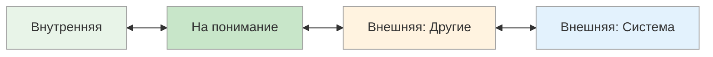

# Референция: Внутренняя ↔ Понимание ↔ Другие ↔ Контекст

<small>← [Мотивация](10b_motivation.md) · [Далее: Врата сортировки →](10d_sorting-gates.md)</small>

🟡 Средний · ⏱ 8 мин

*Почему одного убеждает «я сам так решил», а другого — «все так делают»? Потому что у них разные источники оценки — разная референция. Зная референцию собеседника, вы подбираете аргументы, которые он услышит.*

<b>Кратко</b>

- Внутренняя — «я сам знаю, что правильно»
- На понимание — «объясни логику, тогда приму»
- Внешняя на других — «что говорят эксперты / коллеги?»
- Внешняя на систему — «по правилам так положено»
- При даче ОСВК — адаптируйте форму под референцию получателя

---

*Откуда человек берёт критерии оценки: изнутри или извне?*

### Основные типы

| Полюс | Источник оценки | Ключевой вопрос | Типичные фразы |
|-------|-----------------|-----------------|----------------|
| **Внутренняя** | Собственные ощущения, интуиция | «Что я чувствую?» | «Я чувствую, что это правильно», «Мне кажется...», «Я сам знаю» |
| **На понимание** | Логика, понимание механизма | «Как это работает?» | «Объясни, почему», «Теперь понял — можно делать», «В чём логика?» |
| **Внешняя: Другие** | Мнения конкретных людей | «Что скажут другие?» | «Эксперты рекомендуют...», «А как у коллег?», «Что посоветуешь?» |
| **Внешняя: Система** | Правила, регламенты, традиции | «Что говорят правила?» | «По правилам так положено», «В инструкции написано», «Так принято» |

### Как распознать

**Внутренняя референция:**
- Принимает решения на основе собственных ощущений
- Сложно переубедить внешними аргументами
- Не нуждается в подтверждении — «просто знаю»
- Может игнорировать полезную обратную связь

**Референция на понимание механизма:**
- Нужно понять, КАК и ПОЧЕМУ что-то работает, прежде чем действовать
- «Понял — значит могу доверять и действовать»
- Ближе к внутренней: критерий оценки внутри (моё понимание)
- Может изучать правила, но чтобы понять их логику, а не просто подчиниться
- Если логика не убеждает — может не принять правило

**Внешняя референция на других:**
- Ищет подтверждение у конкретных людей
- Ценит отзывы, рейтинги, мнения экспертов
- Важно, что скажут коллеги, друзья, авторитеты
- «А что бы ты сделал на моём месте?»

**Внешняя референция на систему:**
- Следует правилам, регламентам, законам, традициям
- Важны стандарты, инструкции, «как принято»
- Часто не задаётся вопросом «почему» — достаточно «так положено»
- Может перекладывать ответственность на «систему»

### Где пересекаются «понимание» и «система»

Человек с референцией на понимание может изучать систему правил, чтобы понять её логику. Но он делает это не чтобы подчиниться, а чтобы убедиться, что система «имеет смысл». Если логика не убеждает — он может не принять правило, даже если оно официальное.

Человек с референцией на систему примет правило, потому что оно существует, не требуя объяснений.

> **Попробуйте:** Определите свою референцию в профессиональных решениях — откуда вы чаще всего берёте критерии: из внутренних ощущений, понимания логики, мнений коллег или корпоративных стандартов?

### Сильные и слабые стороны

| Тип | Плюсы | Минусы |
|-----|-------|--------|
| **Внутренняя** | Самостоятельность, уверенность, быстрые решения | Может игнорировать обратную связь, упрямство |
| **На понимание** | Глубокое понимание, осознанные решения | Медленнее принимает решения, может «застрять» в анализе |
| **Внешняя: Другие** | Гибкость, учёт мнений, командность | Зависимость от других, сложности с самостоятельными решениями |
| **Внешняя: Система** | Дисциплинированность, надёжность, предсказуемость | Негибкость, сложности когда правила не прописаны или устарели |

### Применение

| Контекст | Более эффективный полюс |
|----------|-------------------------|
| Лидерство, принятие сложных решений | Внутренняя |
| Творческая работа | Внутренняя |
| Инженерия, архитектура, наука | На понимание |
| Отладка, troubleshooting | На понимание |
| Работа с клиентами, сервис | Внешняя: Другие |
| Продажи, переговоры | Внешняя: Другие |
| Бухгалтерия, юриспруденция | Внешняя: Система |
| Контроль качества, compliance | Внешняя: Система |

**Связь с ОСВК:** При даче обратной связи:
- **Внутренняя** — задавайте вопросы, дайте прийти к выводу самому
- **На понимание** — объясняйте механизм и логику, отвечайте на «почему»
- **Внешняя: Другие** — давайте мнения экспертов и сравнения
- **Внешняя: Система** — ссылайтесь на стандарты, правила и авторитетные источники

---

## Подстройка

### Речевые паттерны

| Полюс | Примеры фраз для подстройки |
|-------|----------------------------|
| **Внутренняя (Я сам)** | «Вы всегда сможете сами решить», «Решение за вами», «Вы хотите полный комплект или облегчённый?», «Что для вас важнее?», «Могли бы вы выбрать прямо сейчас?», «Что вам подсказывает внутренний голос?», «Вспомните, как вы поступали раньше», «Готовы ли вы принять решение?» |
| **На понимание** | «Это работает так, потому что...», «Принцип в том, что...», «Логика следующая...», «Механизм такой...», «Давайте разберём, как это устроено», «Если понять принцип, то...» |
| **Внешняя: Другие** | «Прислушайтесь к мнению близких», «Я как профессионал могу сказать...», «Если бы я был на вашем месте...», «Ассоциация стоматологов рекомендует», «У вашего соседа такой же», «Это покупают профессионалы», «70% населения выбирают...», «Это модно среди...», «А что бы выбрала ваша жена?», «Мой знакомый эксперт сказал...» |
| **Внешняя: Контекст/Система** | «Анализ рынка подтверждает», «Мнения всех экспертов сходятся», «Жизнь диктует свои условия», «В соответствии с планами компании», «Так как ситуация изменилась», «По правилам...», «Согласно стандартам...» |

### Примеры подстройки

| Ситуация | Для внутренней | Для «на понимание» | Для внешней (другие) | Для внешней (система) |
|----------|----------------|--------------------|-----------------------|----------------------|
| Рекомендация решения | «Вы сами лучше знаете, что вам подходит. Какой вариант ближе?» | «Этот вариант лучше, потому что устраняет узкое место — вот как это работает...» | «Большинство клиентов в похожей ситуации выбирают этот вариант» | «Согласно отраслевым стандартам, оптимальное решение —...» |
| Обратная связь | «Как вы сами оцениваете результат?» | «Давайте разберём, почему получилось именно так — какой механизм сработал» | «Коллеги отметили, что получилось хорошо» | «По критериям оценки проекта — это отличный результат» |

> **Попробуйте:** При следующей просьбе дать совет определите референцию человека по вопросу. Если спрашивает «что ты думаешь?» — внешняя на других. Если «как это работает?» — на понимание.

---

**Далее:** [Врата сортировки](10d_sorting-gates.md) — Люди • Ценности • Процессы • Вещи • Время • Место

← [Мотивация](10b_motivation.md)
