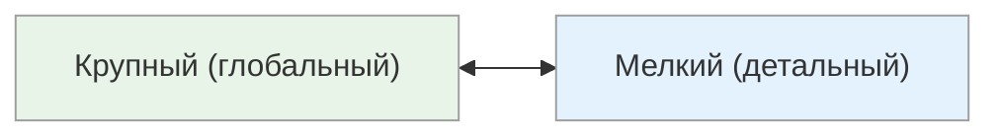

# Размер блока: Глобальный ↔ Детальный

<small>← [Врата сортировки](10d_sorting-gates.md) · [Далее: Способ мышления →](10e2_thinking-style.md)</small>

🟢 Базовый · ⏱ 7 мин

*Руководитель спрашивает «ну как проект?» — один отвечает «в целом хорошо», другой начинает перечислять 47 задач. Оба правы. Но только один из них говорит на языке руководителя.*

<b>Кратко</b>

- Глобальный — концепции, суть, «с высоты птичьего полёта»
- Детальный — конкретика, пошаговость, нюансы
- Типичный конфликт: «Зачем столько слайдов?» ↔ «Слишком поверхностно»
- Универсальная формула: Суть → Детали → Суть

---

*Какой уровень детализации предпочитает человек?*

| Полюс | Фокус | Типичные фразы |
|-------|-------|----------------|
| **Крупный** | Концепции, обзоры, суть, «с высоты птичьего полёта» | «В целом...», «Главная идея...», «Если коротко...», «Суть в том, что...», «Смысл в том, чтобы...» |
| **Мелкий** | Детали, конкретика, пошаговость | «Конкретно...», «Например...», «Шаг первый...», «А именно...», «Если точнее...» |

### Примеры в разных контекстах

**Описание проекта:**

| Полюс | Как расскажет о проекте |
|-------|-------------------------|
| **Крупный** | «Мы делаем платформу для автоматизации HR-процессов. Это сэкономит компаниям время и деньги.» |
| **Мелкий** | «Сначала сотрудник заполняет форму заявки, потом она попадает к руководителю на согласование, затем в бухгалтерию...» |

**Объяснение маршрута:**

| Полюс | Как объяснит дорогу |
|-------|---------------------|
| **Крупный** | «Это в центре, рядом с главной площадью, минут 15 пешком на север» |
| **Мелкий** | «Выходишь из метро, поворачиваешь налево, идёшь 200 метров до светофора, там направо, через два дома будет арка...» |

**Ответ на вопрос «Как дела на работе?»:**

| Полюс | Как ответит |
|-------|-------------|
| **Крупный** | «Нормально, движемся вперёд, скоро большой релиз» |
| **Мелкий** | «Сегодня с утра был созвон с заказчиком, обсудили три пункта по ТЗ, потом я занимался багом в модуле авторизации...» |

### Как распознать

**Крупный блок (глобальный):**
- Начинает с общей картины, «сути»
- Пропускает детали как «очевидные» или «неважные»
- Раздражается от длинных подробных объяснений
- Перебивает: «Короче, что в итоге?»
- Предпочитает резюме, выводы, executive summary
- Легко видит паттерны и связи между явлениями
- Может упускать важные нюансы

**Мелкий блок (детальный):**
- Начинает с конкретики, последовательности шагов
- Чувствует себя некомфортно без деталей
- Раздражается от «поверхностных» объяснений
- Переспрашивает: «А конкретнее?», «Например?»
- Предпочитает пошаговые инструкции, чек-листы
- Замечает нюансы и исключения
- Может «утонуть» в деталях, потеряв общую картину

> **Попробуйте:** Опишите свой текущий проект коллеге с «глобальным» мышлением в трёх предложениях максимум — только суть, без деталей.

### Типичные конфликты

| Ситуация | Глобальный думает | Детальный думает |
|----------|-------------------|------------------|
| Презентация проекта | «Зачем столько слайдов? Можно было в трёх словах» | «Слишком общо, непонятно, как это работает» |
| Постановка задачи | «Я же объяснил суть, дальше сам разберётся» | «Что конкретно делать? Нужны требования» |
| Отчёт о работе | «Много букв, где выводы?» | «Слишком кратко, где обоснование?» |
| Обучение | «Дай мне понять принцип, детали сам найду» | «Покажи пошагово, потом пойму принцип» |

### Сильные и слабые стороны

| Полюс | Плюсы | Минусы |
|-------|-------|--------|
| **Крупный** | Видит общую картину, быстро схватывает суть, хорош в стратегии | Может упускать критические детали, «дьявол в мелочах» |
| **Мелкий** | Точность, внимание к нюансам, качественное исполнение | Может терять общую картину, «за деревьями не видит леса» |

### Применение

| Контекст | Более эффективный полюс |
|----------|-------------------------|
| Стратегическое планирование | Крупный |
| Презентация руководству | Крупный |
| Написание ТЗ, спецификаций | Мелкий |
| Тестирование, контроль качества | Мелкий |
| Обучение новичков | Крупный → Мелкий (сначала контекст, потом детали) |

### Как работать вместе

**Если вы глобальный, а собеседник детальный:**
- Будьте готовы давать конкретику по запросу
- Не раздражайтесь на уточняющие вопросы — это его способ понять
- Начните с сути, но имейте детали «в запасе»

**Если вы детальный, а собеседник глобальный:**
- Начните с главного вывода, потом углубляйтесь
- Спрашивайте: «Нужны подробности или достаточно?»
- Готовьте краткое резюме

**Универсальная формула:** Суть → Детали → Суть (начать с главного, дать нужный уровень подробностей, вернуться к выводам).

---

## Подстройка

| Полюс | Примеры фраз для подстройки |
|-------|----------------------------|
| **Глобальный (крупный)** | «Следуя за общим прогрессом», «В соответствии с миссией», «С концептуальной точки зрения», «В целом», «Главное направление», «В глобальном масштабе», «Суть в том, что...», «Если коротко...» |
| **Детальный (мелкий)** | «Рассматривая подробнее», «Понимая значение каждого элемента», «В частности», «В деталях», «А именно», «Обратите внимание на пятый пункт», «Конкретизируя», «Не бывает незначимых мелочей» |

> **Попробуйте:** Объясните суть своей работы за 30 секунд кому-то с глобальным мышлением — без деталей, только главное.

---

**Далее:** [Способ мышления](10e2_thinking-style.md) — Обобщение ↔ Детализация ↔ Аналогия

← [Врата сортировки](10d_sorting-gates.md)
