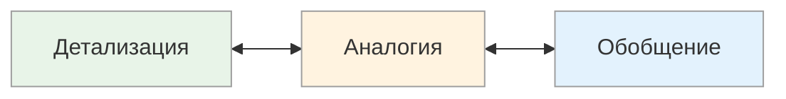

# Способ мышления: Обобщение ↔ Детализация ↔ Аналогия

<small>← [Размер блока](10e1_chunk-size.md) · [Далее: Репрезентативная система →](10e3_rep-systems.md)</small>

🟡 Средний · ⏱ 7 мин

*Три человека объясняют задержку проекта. Первый: «Это типичное бутылочное горлышко». Второй: «2 дня на ТЗ, 3 дня на подрядчика, 1 день на...». Третий: «Это как пробка на дороге». Три способа думать — три способа объяснять.*

<b>Кратко</b>

- Детализация (дедукция) — от общего к частному: «из чего состоит?»
- Аналогия (традукция) — на одном уровне: «на что похоже?»
- Обобщение (индукция) — от частного к общему: «что это значит в целом?»
- Эффективная коммуникация использует все три: обобщение → аналогия → детализация

---

*Как человек движется между уровнями обобщения?*

| Способ | Направление | Логическая операция | Типичные фразы |
|--------|-------------|---------------------|----------------|
| **Детализация** | От общего к частному | Дедукция | «Состоит из...», «Включает в себя...», «Перейдём к конкретике...», «Это делится на...» |
| **Аналогия** | На одном уровне | Традукция | «По аналогии...», «Это как...», «Похоже на...», «Напоминает...» |
| **Обобщение** | От частного к общему | Индукция | «Суммируя...», «Подводя итоги...», «Всё это можно назвать...», «В целом это значит...» |

### Примеры в разных контекстах

**Объяснение, что такое «стартап»:**

| Способ | Как объяснит |
|--------|--------------|
| **Детализация** | «Стартап включает: идею, команду, MVP, привлечение инвестиций, масштабирование...» |
| **Аналогия** | «Стартап — это как посадить дерево: сначала семечко, потом ухаживаешь, потом собираешь плоды» |
| **Обобщение** | «Стартап — это форма бизнеса с высоким риском и высоким потенциалом роста» |

**Анализ проблемы:**

| Способ | Как подходит к проблеме |
|--------|-------------------------|
| **Детализация** | «Давайте разберём по частям: что именно не работает? какой компонент? на каком шаге?» |
| **Аналогия** | «У нас была похожая ситуация в прошлом проекте, там мы сделали так...» |
| **Обобщение** | «Это типичная проблема масштабирования, которая возникает у всех растущих команд» |

> **Попробуйте:** Объясните кому-нибудь сложную концепцию через аналогию — найдите знакомый объект или процесс, на который это похоже.

### Как распознать

**Детализация (дедуктивное мышление):**
- Разбивает целое на части
- Любит структуры, иерархии, классификации
- Спрашивает: «Из чего это состоит?», «Какие этапы?»
- Хорошо создаёт инструкции и процедуры
- Может «уйти в детали» и потерять главное

**Аналогия (традуктивное мышление):**
- Ищет параллели и сходства
- Объясняет новое через знакомое
- Спрашивает: «На что это похоже?», «Где мы такое видели?»
- Хорошо переносит опыт из одной области в другую
- Может делать ложные аналогии («это совсем другое!»)

**Обобщение (индуктивное мышление):**
- Выводит общие правила из частных случаев
- Ищет паттерны и закономерности
- Спрашивает: «Что это значит в целом?», «Какой вывод?»
- Хорошо формулирует принципы и концепции
- Может делать поспешные обобщения на малой выборке

### Типичные конфликты

| Ситуация | Как воспринимают друг друга |
|----------|-----------------------------|
| Детализатор ↔ Обобщатель | «Он тонет в мелочах» ↔ «Он говорит абстракциями» |
| Детализатор ↔ Аналогист | «Причём тут это сравнение?» ↔ «Почему нельзя просто понять по аналогии?» |
| Обобщатель ↔ Аналогист | «Это не принцип, это частный случай» ↔ «Зачем усложнять, вот же пример» |

### Сильные и слабые стороны

| Способ | Плюсы | Минусы |
|--------|-------|--------|
| **Детализация** | Чёткость, структурность, ничего не упущено | Может быть громоздко, теряется «лес за деревьями» |
| **Аналогия** | Быстрое понимание, перенос опыта, креативность | Ложные аналогии, упрощение сложного |
| **Обобщение** | Видение паттернов, принципы, концептуальность | Поспешные выводы, игнорирование исключений |

### Применение

| Контекст | Более эффективный способ |
|----------|--------------------------|
| Создание инструкций, процедур | Детализация |
| Декомпозиция задач | Детализация |
| Обучение через знакомое | Аналогия |
| Мозговой штурм, креатив | Аналогия |
| Формулирование стратегии | Обобщение |
| Извлечение уроков (lessons learned) | Обобщение |
| Диагностика проблем | Детализация + Аналогия |
| Презентация идеи | Обобщение + Аналогия |

### Связь с размером блока

Детализация и обобщение — это *направления движения* между уровнями. Размер блока — это *предпочитаемый уровень*.

| Комбинация | Описание | Пример |
|------------|----------|--------|
| Крупный блок + Обобщение | Живёт на уровне концепций, поднимается ещё выше | Философ, стратег |
| Крупный блок + Детализация | Видит общую картину, но может спуститься к деталям | Архитектор, руководитель |
| Мелкий блок + Детализация | Живёт в деталях, углубляется ещё больше | Аналитик, тестировщик |
| Мелкий блок + Обобщение | Работает с деталями, но ищет в них паттерны | Исследователь, data scientist |

### Как использовать все три способа

Эффективная коммуникация часто требует всех трёх способов:

1. **Обобщение** — дать контекст: «Это про оптимизацию процессов»
2. **Аналогия** — сделать понятным: «Как конвейер на заводе»
3. **Детализация** — дать конкретику: «Состоит из трёх этапов: приём, обработка, выдача»

---

## Подстройка

| Способ | Примеры фраз для подстройки |
|--------|----------------------------|
| **Детализация** | «Состоит из...», «Углубляясь в содержание», «Перейдём к конкретике», «В составе», «Исходя из годового плана, планируем квартал», «Включает в себя», «Реализация состоит из 5 шагов» |
| **Обобщение** | «Суммируя вышесказанное», «Подводя итоги», «Всё это можно назвать...», «В целом это означает...», «Главный вывод» |
| **Аналогия** | «По аналогии», «Это так же, как...», «Вызывает ассоциации с...», «Похоже на...», «Подобно...», «Аналогично» |

**Пример — одна ситуация, три способа:**

| Способ | Как объяснить задержку проекта |
|--------|--------------------------------|
| **Детализация** | «Задержка складывается из: 2 дней на согласование ТЗ, 3 дней на поиск подрядчика, 1 дня на...» |
| **Аналогия** | «Это как пробка на дороге — один затор создаёт цепную реакцию» |
| **Обобщение** | «Это типичный эффект "бутылочного горлышка" — один узкий участок тормозит весь процесс» |

> **Попробуйте:** Опишите сложную проблему на работе тремя способами: разбив на части, найдя аналогию и сделав общий вывод. Какой способ дался легче?

---

**Далее:** [Репрезентативная система](10e3_rep-systems.md) — Визуальная • Аудиальная • Кинестетическая • Дигитальная

← [Размер блока](10e1_chunk-size.md)
