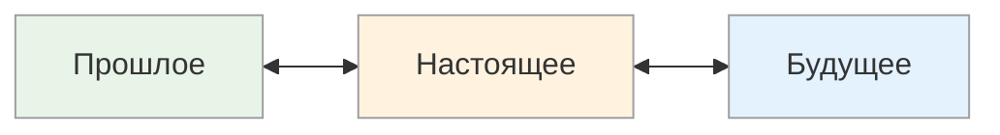
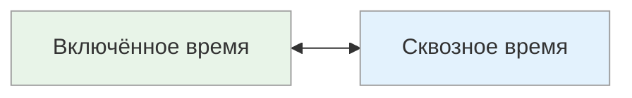

# Ориентация во времени: Прошлое ↔ Настоящее ↔ Будущее / Включённое ↔ Сквозное

<small>← [Репрезентативная система](10e3_rep-systems.md) · [Далее: Убедители →](10g_convincers.md)</small>

🟡 Средний · ⏱ 8 мин

*На ретроспективе один обсуждает «что было», другой — «что делаем сейчас», третий — «куда идём дальше». И ещё один говорит «давай после обеда где-то», а другой — «давай в 14:30 на 20 минут». Два измерения времени: направление и способ переживания.*

<b>Кратко</b>

- Направление: прошлое (опыт), настоящее (момент), будущее (планы)
- Переживание: включённое (погружение, потеря счёта) vs сквозное (контроль, пунктуальность)
- Здоровый баланс: прошлое для уроков, настоящее для действий, будущее для целей
- Подстройка: используйте временной язык собеседника

---

*Куда направлено внимание человека — в прошлое, настоящее или будущее? И как он переживает время — изнутри или со стороны?*

## Временная ориентация

*На какой временной период человек обращает внимание в первую очередь?*

| Полюс | Фокус | Типичные фразы |
|-------|-------|----------------|
| **Прошлое** | Опыт, история, традиции | «Раньше было...», «Мы уже пробовали...», «История показывает...», «Помнишь, как...» |
| **Настоящее** | Текущий момент, что происходит сейчас | «Сейчас важно...», «В данный момент...», «Что мы имеем...», «Здесь и сейчас» |
| **Будущее** | Планы, цели, возможности | «В будущем...», «Это приведёт к...», «Представьте, когда...», «Через год мы...» |

### Пример: обсуждение нового проекта

| Ориентация | Как отреагирует |
|------------|-----------------|
| **Прошлое** | «Мы уже делали похожий проект в 2019 году. Тогда столкнулись с проблемами X и Y. Давайте учтём этот опыт.» |
| **Настоящее** | «Какие ресурсы у нас есть прямо сейчас? Кто свободен? Что мы можем начать делать сегодня?» |
| **Будущее** | «Представьте: через полгода этот продукт выходит на рынок. Как изменится наша позиция? Какие возможности это откроет?» |

### Как распознать

**Ориентация на прошлое:**
- Часто ссылается на прошлый опыт
- Ценит традиции и проверенные решения
- Учится на ошибках (своих и чужих)
- Может «застревать» в прошлом, не видя новых возможностей

**Ориентация на настоящее:**
- Фокусируется на том, что происходит здесь и сейчас
- Быстро реагирует на изменения
- Живёт моментом, получает удовольствие от процесса
- Может не учитывать долгосрочные последствия

**Ориентация на будущее:**
- Думает о целях и планах
- Видит возможности и перспективы
- Легко мотивируется видением результата
- Может игнорировать текущую реальность

> **Попробуйте:** Поставьте таймер на 2 минуты и просто наблюдайте за текущим моментом — что происходит вокруг прямо сейчас, без оценок и планов.

### Применение

| Контекст | Более эффективная ориентация |
|----------|------------------------------|
| Анализ рисков, извлечение уроков | Прошлое |
| Оперативное управление, кризисы | Настоящее |
| Стратегическое планирование | Будущее |
| Мотивация команды, продажи | Будущее |
| Постановка целей | Будущее |

### Баланс временных ориентаций

| Ориентация | При избытке | При недостатке |
|------------|-------------|----------------|
| **Прошлое** | «Застревание» в воспоминаниях, страх нового | Повторение одних и тех же ошибок |
| **Настоящее** | Импульсивность, отсутствие планов | Невозможность расслабиться, тревога |
| **Будущее** | «Жизнь в мечтах», откладывание действий | Отсутствие целей, стагнация |

**Здоровый баланс:** Использовать **прошлое** для извлечения уроков, **настоящее** для действий и наслаждения жизнью, **будущее** для целей и мотивации.

---

## Переживание времени

*Как человек ощущает течение времени?*

| Полюс | Описание | Типичные проявления |
|-------|----------|---------------------|
| **Включённое время** | «Счастливые часов не наблюдают» | Погружается в момент, теряет счёт времени, ориентируется по событиям |
| **Сквозное время** | «Всегда знает, сколько времени» | Следит за временем, планирует точно, ориентируется по часам |

### Как распознать

**Включённое время:**
- Часто опаздывает или забывает о времени
- Глубоко погружается в деятельность (состояние «потока»)
- Планирует по событиям: «после обеда», «когда закончу это»
- Раздражается, когда прерывают
- Сложно оценить, сколько времени займёт задача

**Сквозное время:**
- Пунктуален, приходит вовремя
- Легко переключается между задачами по расписанию
- Планирует по часам: «в 15:00», «займёт 2 часа»
- Хорошо оценивает длительность задач

### Пример: договорённость о встрече

| Тип | Как договаривается | Как приходит |
|-----|--------------------|--------------|
| **Включённое** | «Давай после работы где-то» | Приходит, когда освободился (±30 минут) |
| **Сквозное** | «Давай в 18:30 в кафе на углу» | Приходит в 18:25-18:30 |

### Сильные и слабые стороны

| Тип | Плюсы | Минусы |
|-----|-------|--------|
| **Включённое** | Глубокое погружение, креативность, состояние потока | Опоздания, сложности с планированием |
| **Сквозное** | Надёжность, пунктуальность, хорошее планирование | Может не достигать глубокого погружения |

**Совет для включённого времени:** Используйте таймеры и напоминания как «внешние часы».

**Совет для сквозного времени:** Выделяйте блоки «без часов» для творческих задач.

> **Попробуйте:** Понаблюдайте за собой сегодня: вы чаще смотрите на часы или погружаетесь в дела, теряя счёт времени?

---

## Подстройка

### Временная ориентация

| Полюс | Примеры фраз для подстройки |
|-------|----------------------------|
| **Прошлое** | «Прошлый век», «С испокон веков», «Проверено временем», «Раньше, когда...», «Следуя традициям», «Уроки прошлого», «Мудрецы прошлого говорили» |
| **Настоящее** | «Получая удовольствие от каждой секунды», «Прямо сейчас», «В этот момент», «Покупая, вы приобретаете...» |
| **Будущее** | «Заглядывая вперёд на несколько лет», «Завтра вы сможете», «Думая о завтрашнем дне», «Представьте, что произойдёт после...» |

### Переживание времени

| Полюс | Примеры фраз для подстройки |
|-------|----------------------------|
| **Включённое время** | «Вчера, идя из бухгалтерии, встречаю я Иван Иваныча...» (рассказ как переживание), описание через события, а не часы |
| **Сквозное время** | «Вспомнив наши успехи прошлого года, понимая текущую ситуацию, мы можем уверенно заглянуть на три года вперёд», точные указания времени, длительности |

> **Попробуйте:** Договариваясь о следующей встрече, назовите точное время («в 15:00») вместо «после обеда» или наоборот — в зависимости от типа собеседника.

---

**Далее:** [Убедители](10g_convincers.md) — Интенсивность • Число раз • Частота • Период • Интервал

← [Репрезентативная система](10e3_rep-systems.md)
