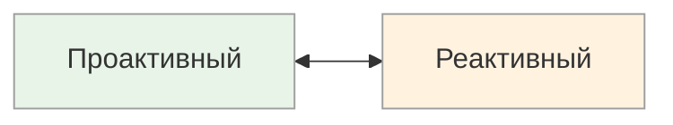

# Проактивный ↔ Реактивный

<small>← [Убедители](10g_convincers.md) · [Далее: Опции ↔ Процедуры →](10i_options-procedures.md)</small>

🟢 Базовый · ⏱ 5 мин

*На совещании один говорит «хватит обсуждать, давайте делать!», другой — «подождите, давайте сначала всё проанализируем». Оба правы — в разных контекстах. Но если вы торопите реактивного или заставляете проактивного ждать — оба будут саботировать.*

<b>Кратко</b>

- Проактивный — инициирует, действует первым, короткие фразы, активный залог
- Реактивный — анализирует, ждёт подходящего момента, длинные предложения
- Подстройка: проактивному — «давайте начнём», реактивному — «подумайте, не спешите»
- Связь с T.O.T.E.: проактивный быстро переходит к операциям, реактивный тщательнее тестирует

---

*Как человек действует: инициирует или ждёт?*

| Полюс | Стиль действия | Типичные фразы |
|-------|----------------|----------------|
| **Проактивный** | Инициирует, действует первым, не ждёт разрешения | «Давайте сделаем», «Я начну с...», «Пора действовать», «Вперёд!» |
| **Реактивный** | Анализирует, ждёт подходящего момента, реагирует на обстоятельства | «Нужно подумать», «Давайте подождём», «Сначала разберёмся», «Посмотрим, как пойдёт» |

### Как распознать

**Проактивный:**
- Быстро переходит к действиям, иногда до полного понимания ситуации
- Использует короткие, энергичные предложения в активном залоге
- Телесно: наклон вперёд, активная жестикуляция
- Может раздражаться от долгих обсуждений
- Берёт инициативу, не ждёт указаний

**Реактивный:**
- Тщательно анализирует перед действием
- Использует длинные предложения, пассивные конструкции, много условных оборотов
- Телесно: откинут назад, спокойная поза
- Может затягивать с началом действий
- Предпочитает реагировать на события, а не создавать их

### Связь с другими метапрограммами

| Комбинация | Описание |
|------------|----------|
| Проактивный + К | Энергично движется к целям |
| Проактивный + ОТ | Быстро действует, чтобы избежать проблем |
| Реактивный + Внутренняя референция | Долго обдумывает, но решает сам |
| Реактивный + Внешняя референция | Ждёт сигналов извне |

### Сильные и слабые стороны

| Полюс | Плюсы | Минусы |
|-------|-------|--------|
| **Проактивный** | Быстрый старт, инициативность, энергия | Может действовать необдуманно, «наломать дров» |
| **Реактивный** | Взвешенность, тщательный анализ, меньше ошибок | Может упустить момент, медлительность |

### Применение

| Контекст | Более эффективный полюс |
|----------|-------------------------|
| Кризисные ситуации | Проактивный |
| Стратегическое планирование | Реактивный |
| Стартапы, продажи | Проактивный |
| Аналитика, исследования | Реактивный |
| Лидерство в изменениях | Проактивный |
| Риск-менеджмент | Реактивный |

**Связь с T.O.T.E.:** Проактивный быстро переходит от T1 (тест) к O (операция). Реактивный тщательнее прорабатывает T1, но может застревать в анализе, не переходя к действию.

> **Попробуйте:** Отследите себя на следующем совещании: вы первым предлагаете решения (проактивный) или сначала слушаете и анализируете (реактивный)?

---

## Подстройка

**Если собеседник проактивный:**
- Переходите к действиям быстро, не затягивайте
- Используйте короткие фразы, активный залог
- «Давайте сделаем», «Начнём с...», «Действуем», «Вперёд»
- Не перегружайте анализом — он хочет делать, а не думать
- Дайте ему возможность начать первым

**Если собеседник реактивный:**
- Дайте время на обдумывание, не торопите
- «Подумайте об этом», «Когда будете готовы...», «Не спешите»
- Предоставьте информацию для анализа
- Не давите, не требуйте немедленного решения
- Уважайте его потребность в осмыслении

**Пример — одно и то же предложение:**

| Проактивный | Реактивный |
|-------------|------------|
| «Давайте начнём прямо сейчас, по ходу разберёмся» | «Возьмите время изучить материалы, и когда будете готовы — обсудим следующие шаги» |

---

**Далее:** [Опции ↔ Процедуры](10i_options-procedures.md) — Выбирает ↔ Следует плану

← [Убедители](10g_convincers.md)
