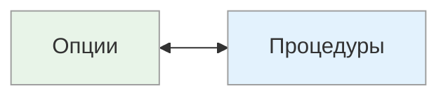

# Опции ↔ Процедуры

<small>← [Проактивный ↔ Реактивный](10h_proactive-reactive.md) · [Далее: Самостоятельный ↔ Командный →](10j_solo-team.md)</small>

🟢 Базовый · ⏱ 5 мин

*Вы спрашиваете коллегу «почему ты выбрал эту работу?». Один перечисляет причины: «интересно, хорошая зарплата, рост». Другой рассказывает историю: «Сначала увидел объявление, потом поговорил с другом, потом...». Первый мыслит опциями, второй — процедурами.*

<b>Кратко</b>

- Опции — выбор, альтернативы, свобода; хорошо генерирует, но может не завершать
- Процедуры — последовательность, план, правильный путь; доводит до конца, но теряется без инструкции
- Отличие от врат сортировки: врата — на ЧТО обращает внимание, опции/процедуры — КАК действует

---

*Как человек предпочитает действовать: выбирать из вариантов или следовать плану?*

| Полюс | Предпочтение | Типичные фразы |
|-------|--------------|----------------|
| **Опции** | Выбор, альтернативы, возможности, свобода | «Есть несколько вариантов...», «Можно также...», «А что если...», «Или так, или так» |
| **Процедуры** | Последовательность, чёткий план, правильный путь | «Сначала... потом...», «По порядку...», «Следующий шаг...», «Согласно инструкции» |

### Как распознать

**Опции:**
- Любит иметь выбор, даже если он избыточен
- Хорошо генерирует альтернативы
- Может с трудом следовать жёсткому плану — ищет способы его обойти
- Часто не доводит начатое до конца — переключается на новые возможности

**Процедуры:**
- Ценит чёткую последовательность шагов
- Хорошо доводит начатое до конца
- Может теряться, когда нет плана или инструкции
- Спрашивает: «Как правильно?», «Какой порядок действий?»

### Как возникают эти паттерны

Человек с фокусом на «опции» часто **начинает** дела, но не всегда заканчивает — появляются новые возможности, которые кажутся интереснее.

Человек с фокусом на «процедуры» часто спрашивает «почему вы выбрали эту работу / купили эту машину?» и рассказывает **историю**: «Сначала я увидел объявление, потом поговорил с другом, потом...» — вместо перечисления причин.

### Сильные и слабые стороны

| Полюс | Плюсы | Минусы |
|-------|-------|--------|
| **Опции** | Креативность, гибкость, способность находить альтернативы | Может не завершать, разбрасываться, сложно с рутиной |
| **Процедуры** | Надёжность, доведение до конца, систематичность | Негибкость, сложно когда нет инструкции |

### Применение

| Контекст | Более эффективный полюс |
|----------|-------------------------|
| Разработка стратегий, мозговой штурм | Опции |
| Исполнение, производство | Процедуры |
| Продажи, переговоры | Опции |
| Операционная работа, бухгалтерия | Процедуры |
| Создание новых продуктов | Опции |
| Контроль качества, compliance | Процедуры |

**Связь с T.O.T.E.:** Человек с фокусом на «опции» легко генерирует альтернативные O (операции), когда текущая не работает. Человек с фокусом на «процедуры» хорошо выстраивает последовательность O и доводит её до конца.

**Связь с вратами сортировки:** «Процедуры» как метапрограмма отличается от «Процессы/Процедуры» как врат сортировки. Врата — это то, **на что** человек обращает внимание. Метапрограмма «Опции/Процедуры» — это то, **как** он предпочитает действовать.

> **Попробуйте:** Вспомните три незавершённых дела. Если их много — возможно, у вас фокус на опции: легко начинаете, но сложно доводите до конца.

---

## Подстройка

**Если собеседник с фокусом на «опции»:**
- Предлагайте варианты на выбор
- «Есть несколько способов...», «Можно так или так...», «Выбирайте»
- Не навязывайте единственный путь — он будет сопротивляться
- Дайте возможность участвовать в создании решения

**Если собеседник с фокусом на «процедуры»:**
- Давайте чёткую последовательность шагов
- «Сначала... затем... после этого...», «Шаг первый, шаг второй...»
- Структурируйте информацию пошагово
- Отвечайте на вопрос «как правильно?»

**Пример — одно и то же предложение:**

| Опции | Процедуры |
|-------|-----------|
| «Есть три варианта решения: путь A, B или C — какой вам ближе?» | «Решение состоит из трёх шагов: сначала делаем A, затем B, в конце C» |

> **Попробуйте:** При следующей постановке задачи коллеге с «опциями» дайте 2-3 варианта на выбор, а коллеге с «процедурами» — чёткую пошаговую инструкцию.

---

**Далее:** [Самостоятельный ↔ Командный](10j_solo-team.md) — Один ↔ В группе ↔ Координирует

← [Проактивный ↔ Реактивный](10h_proactive-reactive.md)
