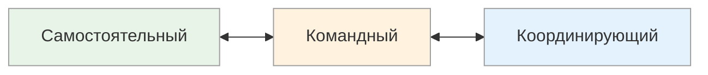

# Самостоятельный ↔ Командный ↔ Координирующий

<small>← [Опции ↔ Процедуры](10i_options-procedures.md) · [Далее: Взаимодействие метапрограмм →](10k_interactions.md)</small>

🟢 Базовый · ⏱ 5 мин

*Одному комфортно работать в наушниках весь день. Другой идёт обсуждать задачу к коллегам через 10 минут. Третий сразу начинает распределять: «ты делаешь это, я — то». Три стиля работы — и ни один не лучше другого.*

<b>Кратко</b>

- Самостоятельный — работает один, несёт личную ответственность, использует «я»
- Командный — ищет взаимодействия, мотивируется присутствием других, использует «мы»
- Координирующий — распределяет роли, видит картину целиком
- Подстройка: самостоятельному — автономию, командному — поддержку, координирующему — роль организатора

---

*Как человек предпочитает работать: один, в группе или управляя группой?*

| Полюс | Предпочтение | Типичные фразы |
|-------|--------------|----------------|
| **Самостоятельный** | Работать одному, нести личную ответственность | «Я сделаю сам», «Мне проще одному», «Это моя зона», «Не мешайте» |
| **Командный** | Работать вместе, разделять ответственность | «Давайте вместе», «Мы как команда», «Нужна поддержка», «Вместе веселее» |
| **Координирующий** | Управлять процессом, распределять задачи | «Ты делаешь это, я — то», «Нужно организовать», «Кто за что отвечает?» |

### Как распознать

**Самостоятельный:**
- Берёт задачу целиком и несёт за неё полную ответственность
- Может не делиться информацией и прогрессом
- Использует «я» в рассказах о достижениях

**Командный:**
- Ищет взаимодействия, делится и запрашивает обратную связь
- Мотивируется присутствием других
- Использует «мы» в рассказах о достижениях

**Координирующий:**
- Естественно распределяет роли и задачи
- Видит, кто что может сделать лучше
- В рассказах описывает, как организовал процесс

### Сильные и слабые стороны

| Полюс | Плюсы | Минусы |
|-------|-------|--------|
| **Самостоятельный** | Глубокая экспертиза, ответственность, независимость | Может быть «бутылочным горлышком», не делегирует |
| **Командный** | Сотрудничество, синергия, поддержка | Может быть неэффективен один, зависимость от группы |
| **Координирующий** | Организаторские способности, видит картину целиком | Может избегать «грязной работы», терять связь с деталями |

### Применение

| Контекст | Более эффективный полюс |
|----------|-------------------------|
| Глубокая экспертная работа | Самостоятельный |
| Проекты, требующие разных навыков | Командный |
| Управление, координация | Координирующий |
| Исследования, написание кода | Самостоятельный |
| Мозговой штурм, дизайн-сессии | Командный |
| Запуск продукта, оркестрация процессов | Координирующий |

### Комбинации с другими метапрограммами

| Комбинация | Описание |
|------------|----------|
| Самостоятельный + Внутренняя референция | Полностью автономен, сам ставит и оценивает задачи |
| Командный + Внешняя референция | Ориентирован на мнение группы |
| Координирующий + Глобальный | Видит общую картину и распределяет роли |
| Координирующий + Процедуры | Выстраивает чёткие процессы для команды |

> **Попробуйте:** Возьмите небольшую задачу и выполните её полностью самостоятельно, без обсуждения с коллегами. Комфортно или хочется поделиться?

---

## Подстройка

**Если собеседник самостоятельный:**
- Подчёркивайте его личную ответственность и автономию
- «Вы сами решаете», «Это ваша зона», «Полностью на вас»
- Не навязывайте командную работу
- Дайте пространство для самостоятельной работы

**Если собеседник командный:**
- Подчёркивайте совместность, поддержку
- «Мы вместе», «Команда поможет», «Вы не один», «Вместе справимся»
- Показывайте, кто ещё участвует
- Не оставляйте его одного с задачей

**Если собеседник координирующий:**
- Дайте ему роль организатора
- «Вы можете распределить задачи», «Как бы вы организовали это?»
- Говорите о процессе управления
- Дайте возможность влиять на структуру

> **Попробуйте:** Предложите идею проактивному человеку через «давайте начнём прямо сейчас», а реактивному — «подумайте, я готов обсудить, когда будете готовы». Почувствуйте разницу в реакции.

---

**Далее:** [Взаимодействие метапрограмм](10k_interactions.md) — Конфликты, синергия, алгоритм подстройки

← [Опции ↔ Процедуры](10i_options-procedures.md)
