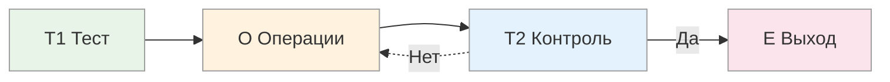
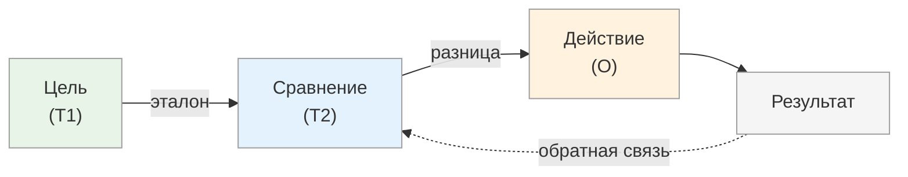

# Модель T.O.T.E.: петля обратной связи

<small>← [Кривая Бандуры](../learning-cycle/03_bandura.md) · [Далее: T1 — Входной тест →](04a_t1-test.md)</small>

🟢 Базовый · ⏱ 5 мин

*Термостат, навык вождения и запуск проекта работают по одной модели. T.O.T.E. — эта модель. Поняв её, вы увидите петли обратной связи везде — и научитесь ими управлять.*

<b>Кратко</b>

- T.O.T.E. = Test → Operate → Test → Exit — базовая структура целенаправленного поведения
- T1 — определение цели и критериев «готово»
- O — действия для изменения состояния
- T2 — проверка: приблизились к цели? Если нет → обратно к O
- E — выход: фиксация результата

---

**T.O.T.E.** (Test-Operate-Test-Exit) — модель, описывающая базовую структуру любого целенаправленного поведения. Предложена Миллером, Галантером и Прибрамом в 1960 году как альтернатива бихевиористской схеме «стимул-реакция».

По своей сути T.O.T.E. — это **модель петли обратной связи**: фундаментального механизма, управляющего поведением любых систем — от термостата до человеческого навыка, от биологической клетки до корпорации.

---

## Структура модели

| Элемент | Функция | Подробнее |
|---------|---------|-----------|
| **T1** | Определение желаемого состояния и критериев его достижения | [T1 — Входной тест](04a_t1-test.md) |
| **O** | Операции (действия) для изменения текущего состояния | [O — Операции](04b_operations.md) |
| **T2** | Проверка результата, сравнение с критериями T1 | [T2 — Обратная связь](04c_t2-feedback.md) |
| **E** | Выход из цикла: фиксация результата и закрытие процесса | [E — Выход](04d_exit.md) |

> 🔗 **Продвинутое:** Фрактальная структура, антипаттерны, примеры применения — [04e](04e_advanced.md)

---

## T.O.T.E. как петля обратной связи

Петля обратной связи — структура, в которой:
1. Система имеет **цель** (желаемое состояние)
2. Система **действует** для достижения цели
3. Результат действия **сравнивается** с целью
4. Разница между результатом и целью **влияет на следующее действие**

**Примеры петель обратной связи:**

| Система | Цель (T1) | Действие (O) | Обратная связь (T2) |
|---------|-----------|--------------|---------------------|
| Термостат | Заданная температура | Включение/выключение нагрева | Показания датчика |
| Велосипедист | Вертикальное положение | Повороты руля, смещение веса | Вестибулярные ощущения |
| Оратор | Внимание аудитории | Изменение темпа, жесты, вопросы | Реакция слушателей |
| Производство | План выпуска | Управление ресурсами | Фактический выпуск |

### Почему петли обратной связи — точки рычага

> **Петли обратной связи — это точки максимального рычага.**
> Воздействие на петлю обратной связи оказывает бо́льшее влияние на систему, чем воздействие на любой отдельный элемент.

1. **Петли управляют поведением системы во времени** — эффект накапливается на каждом цикле
2. **Петли определяют устойчивость системы** — правильная обратная связь = основа адаптации
3. **Петли создают порочные или добродетельные круги** — положительная усиливает изменения, отрицательная стабилизирует

**Следствие:** Если хотите понять систему — найдите её петли. Хотите изменить — воздействуйте на петли. Хотите передать навык — передайте структуру его петли обратной связи.

---

**Далее:** [T1 — Входной тест](04a_t1-test.md) — определение желаемого состояния и критериев

← [Кривая Бандуры](../learning-cycle/03_bandura.md)
