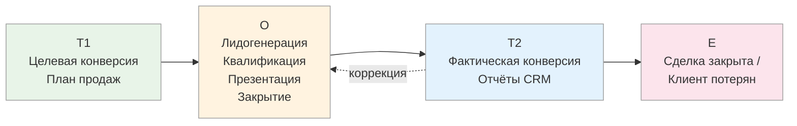
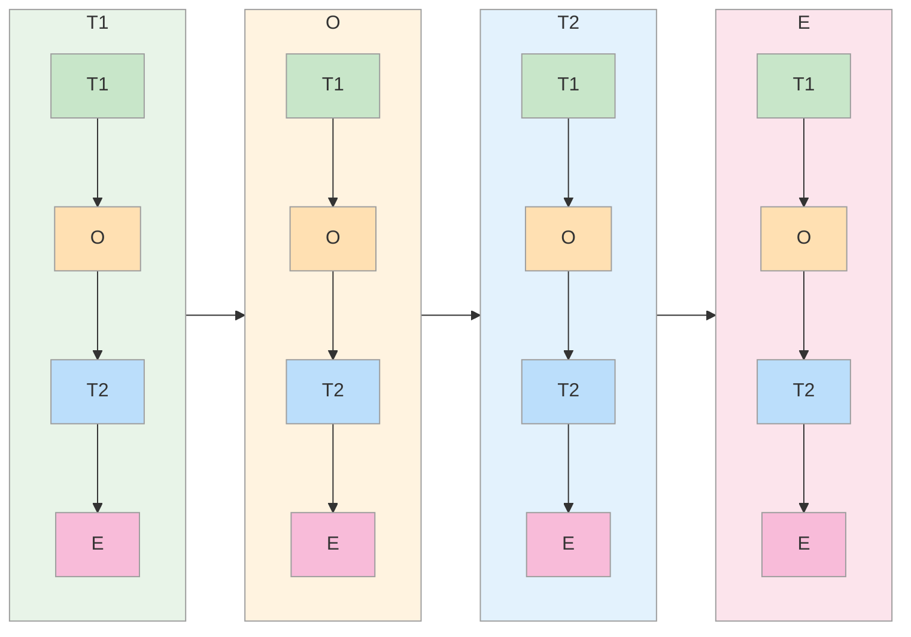

# Продвинутое применение T.O.T.E.

<small>← [E — Выход](04d_exit.md) · [Далее: Вопросы для моделирования →](05_tote-questions.md)</small>

🔴 Продвинутый · ⏱ 10 мин

*T.O.T.E. — не только про задачи. Внутри каждого T.O.T.E. живут вложенные T.O.T.E., а антипаттерны показывают, где модель ломается. Это страница для тех, кто хочет видеть фрактальность систем.*

<b>Кратко</b>

- Любой навык — автоматизированная петля обратной связи
- T.O.T.E. применим к продажам, диагностике, моделированию навыков
- Фрактальная структура: каждый элемент T.O.T.E. сам является T.O.T.E.
- 7 ключевых принципов и 5 антипаттернов

---

## Моделирование навыков

Любой навык — автоматизированная петля обратной связи:
- Эксперт неосознанно сравнивает результат с эталоном (T1 → T2)
- При отклонении автоматически корректирует действия (O)
- Цикл повторяется с высокой скоростью

**Моделирование навыка** через T.O.T.E. означает выявление:
- Каковы критерии, которые эксперт держит в голове?
- Какие операции он выполняет?
- Как он получает обратную связь?
- Как корректирует действия?

> **Попробуйте:** Выберите навык, которым владеете хорошо (даже простой: варить кофе, писать письма). Опишите его через T.O.T.E.: какие критерии «правильно», какие действия, как проверяете результат.

---

## Моделирование бизнес-процессов

**Процесс продаж:**

---

## Диагностика систем

T.O.T.E. позволяет диагностировать, **где именно** система даёт сбой:

| Проблема | Вероятный сбой | Решение |
|----------|----------------|---------|
| Система не достигает целей | T1: Критерии размыты | Уточнить критерии |
| Действия не приводят к результату | O: Операции неэффективны | Расширить набор операций |
| Система «не замечает» проблем | T2: Обратная связь отсутствует | Наладить каналы обратной связи |
| Система реагирует слишком медленно | T2 → O: Задержка в коррекции | Ускорить цикл |
| Система «застревает» | E: Нет критериев завершения | Определить условия выхода |

> **Попробуйте:** Диагностируйте любой ваш процесс, который буксует. Используйте таблицу выше — где именно сбой?

---

## Фрактальная структура T.O.T.E.

Ключевое свойство модели: **каждый элемент T.O.T.E. сам может быть полноценным T.O.T.E.**

- **T1** (определение цели) — процесс со своими критериями, операциями, проверками
- **O** (выполнение операций) — каждая операция имеет свою цель, действия, обратную связь
- **T2** (проверка результата) — процесс проверки тоже структурирован как T.O.T.E.
- **E** (фиксация результата) — завершение требует своих критериев и действий

И весь T.O.T.E. может быть элементом ещё большего T.O.T.E.

**Уровни применения:**

| Уровень | Пример |
|---------|--------|
| Микро | Велосипедист корректирует руль за доли секунды |
| Мезо | Разработчик итеративно улучшает код |
| Макро | Компания корректирует стратегию на основе рыночной обратной связи |

**Практическое следствие:** При моделировании сложного процесса можно «зуммировать» в любой элемент и раскладывать его по той же структуре T1 → O → T2 → E.

> **Попробуйте:** Возьмите большую задачу и опишите её как T.O.T.E. Теперь «зумируйте» в операции (O) и распишите одну из них тоже как T.O.T.E. Увидьте фрактальность.

---

## Ключевые принципы

1. **Сенсорные критерии:** Желаемое состояние определяется через наблюдаемые, измеримые признаки
2. **Диагностика старта:** Без понимания текущего состояния невозможна навигация
3. **Множественность операций:** Один путь — уязвимость, много путей — гибкость
4. **Итеративность:** Циклы O → T2 повторяются до достижения или осознанного прекращения
5. **Обратная связь как информация:** Сигнал для коррекции, а не оценка
6. **Гибкость пути:** Цель фиксирована, способы достижения — адаптивны
7. **Завершение как освобождение:** Осознанное закрытие процесса сохраняет ресурсы

---

## Антипаттерны

| Антипаттерн | Этап | Последствие |
|-------------|------|-------------|
| Размытые критерии | T1 | Невозможно оценить достижение |
| Игнорирование текущего состояния | T1 | Неадекватный выбор операций |
| Единственный способ достижения | O | Застревание при препятствиях |
| Упорное повторение неработающего | O | Бесконечный цикл без прогресса |
| Игнорирование обратной связи | T2 | Движение не туда |
| Отсутствие промежуточных проверок | T2 | Поздно обнаруженные отклонения |
| Незавершённые процессы | E | Утечка ресурсов |
| Отсутствие извлечения опыта | E | Повторение ошибок |

> **Попробуйте:** Поймайте себя на одном из антипаттернов сегодня. Просто заметьте: «Вот оно, упорное повторение неработающего» или «Вот, игнорирую обратную связь». Осознание — первый шаг.

---

## Связанные инструменты

- [Вопросы для моделирования T.O.T.E.](05_tote-questions.md) — набор вопросов для выявления структуры навыков и процессов
- [Встраивание T.O.T.E.-мышления](06a_tote-install-intro.md) — программа тренировки мышления петлями обратной связи
- [Спецификация цели](../goal-spec/06_goal-spec.md) — детальный инструмент для проработки T1
- [ОСВК](../feedback/08_osvk-overview.md) — инструмент для качественного наполнения T2
- [Метапрограммы](../metaprograms/10_metaprograms-intro.md) — фильтры восприятия, влияющие на стиль прохождения цикла T.O.T.E.

---

**Далее:** [Вопросы для моделирования](05_tote-questions.md) — выявление структуры навыков и процессов

← [E — Выход](04d_exit.md)
