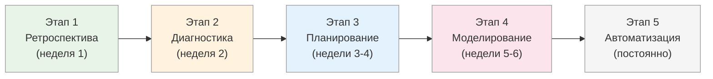

# Встраивание T.O.T.E.-мышления: начало

<small>← [Вопросы для моделирования](05_tote-questions.md) · [Далее: Встраивание T.O.T.E.: продвинутое →](06b_tote-install-advanced.md)</small>

🟡 Средний · ⏱ 6 мин

*Знать модель T.O.T.E. — не значит думать петлями обратной связи. Между пониманием и автоматическим применением — несколько недель практики.*

<details><summary><b>Кратко</b></summary>

Зачем встраивать T.O.T.E.-мышление. Типичные трудности. Программа из 5 этапов. Этапы 1-3: ретроспектива, диагностика, планирование.

</details>

---

<style>
.mermaid {
  text-align: left;
}
.mermaid svg {
  max-width: 100%;
  margin-left: 0;
  margin-right: auto;
  display: block;
}
</style>

**T.O.T.E.** (Test-Operate-Test-Exit) — модель петли обратной связи, описанная в [документе 04](04_tote-overview.md). Она показывает структуру любого целенаправленного поведения: определение цели, действия, проверка результата, выход.

Знать модель — не значит применять её автоматически. Между пониманием «вот так устроен навык» и способностью видеть любую ситуацию через призму петель обратной связи — дистанция в несколько недель осознанной практики.

Этот документ — о том, как встроить T.O.T.E.-мышление в повседневную работу, чтобы думать петлями обратной связи стало естественным.

**Связь с обучением:** Встраивание T.O.T.E. проходит через [4 стадии компетентности](../learning-cycle/02_learning.md) — от неосознанной некомпетентности («не знаю, что не умею видеть петли») к неосознанной компетентности («автоматически вижу структуру T.O.T.E. в любой ситуации»).

---

## Зачем встраивать

Большинство людей уже используют петли обратной связи — но неосознанно. Когда вы ведёте автомобиль, вы не думаете: «Сейчас проверю положение на дороге (T2), скорректирую руль (O), проверю снова (T2)». Вы просто едете — цикл работает автоматически.

**Цель встраивания T.O.T.E.-мышления** — сделать видимым то, что происходит неосознанно. Научиться:
- Видеть любую ситуацию как петлю обратной связи
- Диагностировать, где именно петля ломается (размытая цель? нет проверки? операции не работают?)
- Сознательно усиливать слабые элементы петли

Это мета-навык, который делает все остальные инструменты — [спецификацию цели](../goal-spec/06_goal-spec.md), [ОСВК](../feedback/08_osvk-overview.md), [метапрограммы](../metaprograms/10_metaprograms-intro.md) — намного эффективнее.

**Признак встроенного мышления:** вы автоматически задаёте себе вопросы:
- Какая цель? (T1)
- Что я делаю для её достижения? (O)
- Как я проверяю, что двигаюсь туда? (T2)
- Когда я остановлюсь? (E)

> **Попробуйте:** Прямо сейчас вспомните последнее, что вы делали до чтения этого документа. Опишите это действие через T.O.T.E.: была ли цель? Какие операции? Проверяли ли результат? Как закончили?

---

## Типичные трудности

При попытке применить T.O.T.E. сознательно возникают предсказуемые проблемы:

| Трудность | Проявление | Последствие |
|-----------|-----------|-------------|
| **Забываем определить T1 до начала** | Сразу начинаем действовать, не сформулировав критерии «готово» | Непонятно, когда останавливаться; результат оценивается постфактум |
| **Нет T2 — делаем без проверки** | Выполняем все запланированные операции без промежуточного контроля | Слишком поздно обнаруживаем, что идём не туда |
| **Повторяем одно и то же O, когда оно не работает** | «Если не получилось — попробую ещё раз, но сильнее» | Застревание в неэффективном действии |
| **Не знаем, когда делать Exit** | Нет критериев завершения — либо бросаем раньше времени, либо продолжаем бесконечно | Утечка ресурсов, незакрытые процессы |
| **Переусложняем — пытаемся всё моделировать как T.O.T.E.** | Каждое микродействие расписываем по схеме T1-O-T2-E | Аналитический паралич вместо действия |

> **Попробуйте:** Узнаёте себя в какой-то из трудностей? Вспомните конкретный случай из последних дней, когда столкнулись с этим. Просто осознайте паттерн.

---

## Программа тренировки

Встраивание T.O.T.E.-мышления проходит в пять этапов. Каждый этап — шаг по [кривой Бандуры](../learning-cycle/03_bandura.md): от ретроспективного анализа к автоматическому применению.



### Этап 1. Ретроспективный анализ (неделя 1)

**Цель:** научиться видеть T.O.T.E. в уже выполненных действиях.

**Практика:** После завершения любой задачи (большой или маленькой) опишите её как T.O.T.E.:

| Элемент | Вопрос |
|---------|--------|
| **T1** | Какая была цель? Были ли чёткие критерии «готово»? |
| **O** | Какие операции я использовал? |
| **T2** | Была ли проверка результата? Как часто? Какая обратная связь? |
| **E** | Как я вышел из процесса? Зафиксировал результат? |

**Шаблон для ежедневной практики:**

```
Дата: _______
Задача: _______________________

T1: Цель была: ________________
    Критерии «готово»: ________
    Были ли чёткими? Да/Нет

O:  Операции: _________________
    Были ли альтернативы? Да/Нет

T2: Проверял результат: Да/Нет
    Как часто: _______________
    Какая обратная связь: _____

E:  Как завершил: _____________
    Зафиксировал результат: Да/Нет
    Извлёк урок: ______________
```

**На что обратить внимание:**
- Где T.O.T.E. был полным? Где чего-то не хватало?
- Если задача прошла гладко — какие элементы петли были сильными?
- Если застряли — какой элемент сломался?

> **Попробуйте:** Прямо сейчас возьмите задачу, которую завершили сегодня (любую: от написания письма до встречи). Заполните шаблон выше. Потратьте 2-3 минуты.

---

### Этап 2. Диагностика «где ломается» (неделя 2)

**Цель:** научиться видеть, где именно петля обратной связи даёт сбой.

**Практика:** Для любой застрявшей или проблемной ситуации используйте диагностическую таблицу:

| Симптом | Вероятный сбой | Что делать |
|---------|----------------|-----------|
| Не понимаю, к чему стремлюсь | **T1 размыт** | Уточнить критерии: как выглядит «готово»? |
| Делаю, но не приближаюсь к цели | **O неэффективны** | Попробовать другие операции |
| Не знаю, работает ли то, что делаю | **T2 отсутствует** | Настроить обратную связь: как проверять? |
| Не могу остановиться / бросаю раньше времени | **E не определён** | Установить критерии выхода |
| Повторяю одно и то же, не работает | **Застрял в O → T2** | Сменить операцию, не цель |

**Упражнение:**
1. Выберите проблемную ситуацию из текущих дел
2. Найдите в таблице симптом, который описывает проблему
3. Примените рекомендацию из колонки «Что делать»

> **Попробуйте:** Возьмите задачу, которая буксует прямо сейчас. Используйте таблицу: где сбой? В T1, O, T2 или E? Примените одну рекомендацию прямо сегодня.

---

### Этап 3. Планирование через T.O.T.E. (недели 3-4)

**Цель:** научиться проектировать процесс через T.O.T.E. ДО начала действий.

**Практика:** Перед началом любой задачи явно определите:

**Шаблон планирования:**

```
Задача: _______________________

T1 — Желаемое состояние:
    □ Как выглядит «готово»? ___________
    □ Критерии измеримы? (Да/Нет)
    □ Могу ли проверить однозначно? (Да/Нет)

O — Операции:
    □ Основной путь: ___________
    □ Альтернатива 1: __________
    □ Альтернатива 2: __________
    □ Когда переключусь на альтернативу? _______

T2 — Проверка:
    □ Как буду проверять прогресс? _______
    □ Как часто? __________
    □ Какой сигнал «всё идёт правильно»? _______
    □ Какой сигнал «нужна коррекция»? _______

E — Выход:
    □ Когда остановлюсь? _______
    □ Как зафиксирую результат? _______
    □ Что сделаю для извлечения урока? _______
```

**Правила:**
- Не начинайте работу, пока не заполнили T1 и T2
- Если не можете описать T1 — значит, цель не готова
- Если не знаете T2 — будете работать вслепую

> **Попробуйте:** Возьмите задачу, которую планируете сделать завтра. Заполните шаблон планирования прямо сейчас. Потратьте 5 минут. Завтра используйте этот план.

---

**Далее:** [Встраивание T.O.T.E.: продвинутое](06b_tote-install-advanced.md) — продвинутые этапы и чек-лист

← [Вопросы для моделирования](05_tote-questions.md)
