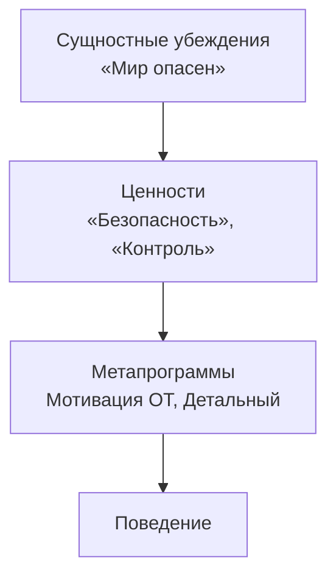

# Что такое ценность

<small>← [Неявные формы выражения убеждений](../beliefs/beliefs-forms.md) · [Далее: Иерархия и динамика ценностей →](values-hierarchy.md)</small>

🟡 Средний · ⏱ 8 мин

*Человек говорит: «Для меня важна свобода». Другой говорит: «Для меня важна свобода». Слово одно — а за ним стоят разные образы, разные ощущения, разные поведенческие последствия. Один ради «свободы» увольняется и едет автостопом, другой — строит бизнес, третий — избегает близких отношений. Ценность — не слово. Ценность — то, что за ним.*

<details><summary><b>Кратко</b></summary>

- Ценность = номинализация + репрезентация (V/A/K/Ad — индивидуально) + сильный внутренний отклик
- Убеждения стоят *над* ценностями и формируют их (модель логических уровней Плигина)
- Убеждения *о* ценностях — отдельный тип: ценность гибкая, убеждение о ней — ригидное
- Ценности активируют метапрограммы: «безопасность» → ОТ, Различие; «свобода» → Опции, Глобальный

</details>

---

## Определение

Ценность — это то, что **важно** для человека. Но «важность» — не абстракция. За словом-ценностью всегда стоит **внутренняя репрезентация** — и именно она делает слово значимым.

Структура ценности:

```
Слово-номинализация (Ad): «свобода», «безопасность», «развитие»
  → Развёртывание в репрезентацию (V / A / K / Ad — индивидуально)
    → Сильный отклик: «Да, это важно»
```

**Ценность = номинализация + репрезентация + сильный внутренний отклик.**

Какая именно репрезентация — зависит от человека. Для одного «свобода» — это яркий образ открытого пространства (V). Для другого — внутренний голос, говорящий «я могу выбирать» (Ad). Для третьего — ощущение лёгкости в теле (K). Репрезентация индивидуальна, но она всегда есть — без неё слово остаётся пустым звуком.

У разных людей за одним словом — разные репрезентации, а значит — разные ценности, хотя номинализация одна и та же.

> **Попробуйте:** Произнесите слово «свобода» (или другую свою ценность). Что появляется? Образ? Ощущение? Где в теле отклик? Насколько он сильный? А теперь спросите друга, что *он* видит за этим словом — и сравните.

---

## Ценности в психологии

Понятие ценностей разрабатывалось в психологии задолго до НЛП, и полезно видеть контекст.

**Милтон Рокич** (1973) разделил ценности на **терминальные** (конечные цели: свобода, счастье, мудрость) и **инструментальные** (способы достижения: честность, ответственность, независимость). Терминальные отвечают на вопрос «ради чего?», инструментальные — «каким способом?».

**Шалом Шварц** (1992) выделил 10 базовых ценностных типов (самостоятельность, стимуляция, гедонизм, достижение, власть, безопасность, конформность, традиция, благожелательность, универсализм) и показал, что они организованы в **круговую структуру**: соседние ценности совместимы, противоположные — конфликтуют. Человек, для которого важна «самостоятельность», будет испытывать напряжение, если ситуация требует «конформности».

**Абрахам Маслоу** (1954) связал ценности с потребностями: пока не закрыты базовые потребности (безопасность, принадлежность), ценности «верхних» уровней (самореализация, творчество) не активируются в полную силу.

Для нашей модели важно вот что: все три подхода описывают *содержание* ценностей (какие бывают, как соотносятся). НЛП добавляет *структуру* — как ценность устроена на уровне репрезентации, субмодальностей и внутреннего отклика. А модель Плигина добавляет ещё один слой: *откуда* ценности берутся — из убеждений.

---

## Откуда берутся ценности: убеждения → ценности

В классической НЛП-модели (пирамида логических уровней Дилтса) убеждения и ценности стоят **на одном уровне**. Однако в научной психологии (когнитивная терапия Бека, схема-терапия Янга) и в модели логических уровней А. Плигина эти уровни разведены: **убеждения стоят *над* ценностями и формируют их**.



Человек, который в раннем опыте усвоил убеждение «мир опасен», не *выбирает* ценность «безопасность» — она формируется как **следствие** убеждения. Ребёнок, выросший в непредсказуемой среде, не «решает», что контроль важен — ценность контроля вырастает из глубинной схемы уязвимости.

**Примеры:**

| Убеждение (сущностное) | Какую ценность порождает | Почему |
|-------------------------|--------------------------|--------|
| «Мир опасен» | Безопасность, контроль | Если мир опасен — безопасность становится приоритетом |
| «Я недостаточно хорош» | Признание, достижение | Если я недостаточен — мне нужно подтверждение через результаты |
| «Люди в целом добры» | Доверие, близость | Если людям можно доверять — близость безопасна и желанна |
| «Мир полон возможностей» | Развитие, свобода | Если возможности есть — хочется их реализовывать |
| «Каждый сам за себя» | Независимость, сила | Если рассчитывать не на кого — нужно быть сильным самому |

Практически это означает: если ценность кажется ригидной и человек не может «просто выбрать другое» — за ней, вероятно, стоит [сущностное убеждение](../beliefs/beliefs-intro.md#сущностные-убеждения). Работа с убеждением может естественным образом перестроить иерархию ценностей.

> **Попробуйте:** Возьмите одну свою ключевую ценность. Спросите: «Почему это для меня так важно? Что я считаю истинным о мире или о себе, из-за чего *это* стало важным?» Ответ — убеждение, стоящее за ценностью.

---

## Чем ценность отличается от убеждения

| | Убеждение | Ценность |
|---|-----------|----------|
| **Что это** | То, что считаю *истинным* | То, что считаю *важным* |
| **Внутренний отклик** | Уверенность, «я знаю» | Значимость, «это важно» |
| **Формулировка** | «Мир устроен так, что...» | «Для меня важно...» |
| **Роль в T.O.T.E.** | Определяет, какие O (операции) кажутся возможными | Определяет T1 (критерии — что считать хорошим результатом) |
| **Иерархия** | Убеждение *над* ценностью — формирует её | Ценность *под* убеждением — порождается им |
| **Связь с поведением** | Убеждение задаёт правила (процедурные) | Ценность задаёт направление (к чему стремиться) |

Подробнее о связи уровней — [Убеждения, ценности и метапрограммы](../beliefs/17_beliefs-and-metaprograms.md#связь-уровней).

---

## Убеждения о ценностях

Это ключевое разграничение, без которого невозможно корректно работать с ценностями — ни при самоанализе, ни при [моделировании из текста](values-modeling.md).

**Ценность** — это то, что человек считает *важным*: «для меня важна честность».

**Убеждение о ценности** — это то, что человек считает *истинным* по поводу ценности: «честность — фундамент любых отношений», «без честности невозможно доверие», «люди должны быть честными».

| | Ценность | Убеждение о ценности |
|---|----------|----------------------|
| **Формулировка** | «Для меня важна честность» | «Люди должны быть честными» |
| **Тип высказывания** | Что важно | Что истинно / что следует делать |
| **Уровень** | Ценность | Убеждение (процедурное, объясняющее или сущностное) |
| **Функция** | Задаёт направление | Фиксирует правила вокруг ценности |

Убеждения о ценностях образуют **каскад** — точно такой же, как и любые другие убеждения:

```
Сущностное:    «Мир держится на честности»
                  ↓
Объясняющее:   «Потому что без честности люди не могут доверять друг другу»
                  ↓
Процедурное:   «Нужно всегда говорить правду»
               «Нельзя молчать, когда видишь ложь»
```

**Почему это важно различать:**

1. **Ценность гибкая, убеждение — ригидное.** Ценность «честность» допускает разные способы реализации. Убеждение «нужно всегда говорить правду» — ригидное правило, которое не учитывает контекст.

2. **Ценность — своя, убеждение о ней — может быть чужим.** «Для меня важна семья» — ценность. «Семья — главное в жизни, всё остальное — второстепенно» — убеждение, возможно навязанное.

3. **Изменение убеждения о ценности не убивает ценность.** Можно перестать верить, что «люди должны быть честными», и при этом продолжать ценить честность — просто реализовывать её иначе, гибче, с учётом контекста.

**Частая ловушка:** Человек говорит «честность для меня важна» — и вы думаете, что это ценность. Но затем он добавляет: «потому что мир полон лжецов и нужно хотя бы самому оставаться честным». Это уже не ценность — это каскад: сущностное убеждение («мир полон лжецов») → ценность («честность») → процедурное убеждение («нужно самому оставаться честным»). Ценность — лишь один элемент в связке.

> **Попробуйте:** Возьмите одну свою ценность. Сформулируйте 2-3 убеждения, которые у вас есть *о* ней. Это правила? Объяснения? Глобальные утверждения? На каком уровне каскада они стоят?

---

## Ценности и метапрограммы

Ценности — это **критерии** в T1-блоке [T.O.T.E.](../tote/04_tote-overview.md) Они определяют, что считается «хорошим результатом», а значит — какие метапрограммы будут активированы для его достижения.

| Ценность | Какие метапрограммы активирует | Почему |
|----------|-------------------------------|--------|
| Безопасность | ОТ, Различие, Детальный | Нужно видеть угрозы (различие), в деталях, и избегать их (ОТ) |
| Развитие | К, Различие на новое, Будущее | Нужно видеть возможности (К), находить новое, ориентируясь на будущее |
| Контроль | Внутренняя референция, Детальный, Процедуры | Нужно решать самому, видеть все части, по чёткому порядку |
| Свобода | Внутренняя референция, Глобальный, Опции | Нужно решать самому, видеть возможности, не увязая в деталях |
| Принадлежность | Внешняя референция, Сходство, Люди | Нужно соответствовать группе, быть похожим, фокус на людях |

Именно поэтому ценности важны в контексте этой книги: они определяют, какие метапрограммы «включаются». Если вы хотите понять, почему человек «застрял» в определённых метапрограммах — ищите ценность, которая их активирует. Подробнее — [Убеждения, ценности и метапрограммы](../beliefs/17_beliefs-and-metaprograms.md#как-ценности-управляют-метапрограммами).

---

## Связанные материалы

- [Иерархия и динамика ценностей](values-hierarchy.md) — иерархия, декларируемые vs реальные, конфликты, эмоции
- [Ценность и способ реализации](values-realization.md) — ценность, цель, способ; как выявить свои ценности
- [Моделирование ценностей из текста](values-modeling.md) — маркеры, дизамбигуация, кросс-проверка
- [Что такое убеждение](../beliefs/beliefs-intro.md) — определение, каскад, подвиды сущностных убеждений
- [Убеждения, ценности и метапрограммы](../beliefs/17_beliefs-and-metaprograms.md) — механизм фиксации, кластеры, иерархия уровней

---

**Далее:** [Иерархия и динамика ценностей](values-hierarchy.md) — иерархия, конфликты, эмоции как индикатор

← [Неявные формы выражения убеждений](../beliefs/beliefs-forms.md)
